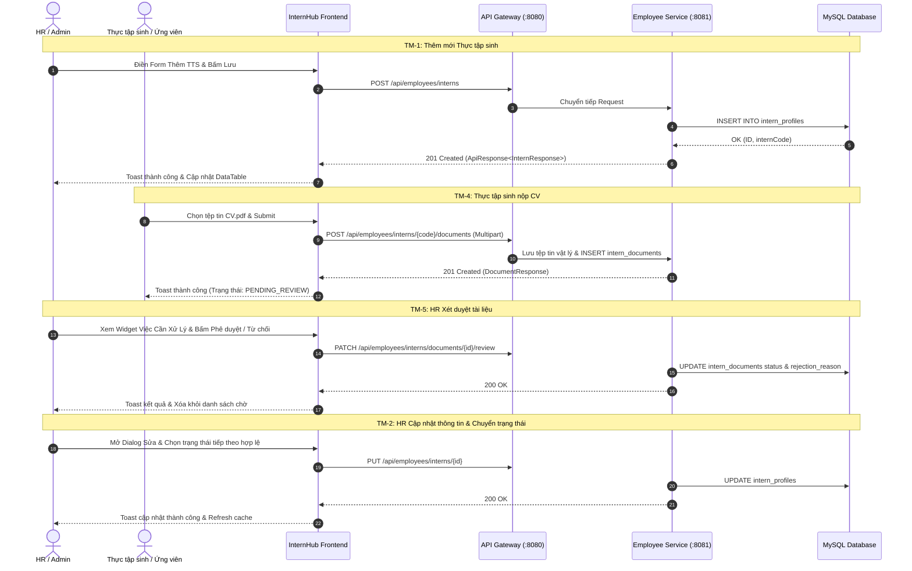

# Technical Implementation Plan: Tích Hợp Frontend TM-1 đến TM-5

> **Mục tiêu:** Kế hoạch triển khai kỹ thuật kết nối trực tiếp các tính năng từ TM-1 đến TM-5 giữa `InternHub-Frontend` và Microservices `employee-service` (qua `api-gateway` port 8080).  
> **Nhánh Git:** `feature/TM-1-to-TM-5/intern-management-core`  
> **Dựa trên quyết định tại Cổng làm rõ:**  
> 1. **TM-4 (Nộp CV/Tài liệu):** Đặt tại khu vực dành cho **Thực tập sinh** (`InternDashboard.tsx` - Trang cá nhân của TTS) và hỗ trợ Route công khai `/apply` (Ứng viên chưa đăng nhập nộp hồ sơ trực tuyến), kết hợp modal nộp hồ sơ nhanh.  
> 2. **TM-2 (Chỉnh sửa TTS):** Dropdown trạng thái áp dụng nghiêm ngặt State Machine của Backend (chỉ hiển thị các trạng thái hợp lệ tiếp theo).  
> 3. **Cơ chế Fallback (Dual Mode):** Ưu tiên gọi API thật `http://localhost:8080`, tự động chuyển sang local mock khi Backend offline.

---

## 1. Cấu Trúc Các Tệp Tin Sẽ Tạo Mới & Chỉnh Sửa

### 1.1. Cấu hình Dữ liệu, Types & Schema
- **[MODIFY] [src/types/index.ts](file:///c:/Users/Luong%20Anh%20Huy/InternHub-Workspace/InternHub-Frontend/src/types/index.ts)**:
  - Bổ sung `UpdateInternRequest` interface theo chuẩn Backend spec TM-2 (hậu tố `*Request`, loại bỏ các type không dùng).
  - Chuẩn hóa `InternStatus`: `'PENDING' | 'APPROVED' | 'INTERNING' | 'COMPLETED' | 'REJECTED' | 'DROPPED'`.
- **[MODIFY] [src/features/interns/schema.ts](file:///c:/Users/Luong%20Anh%20Huy/InternHub-Workspace/InternHub-Frontend/src/features/interns/schema.ts)**:
  - Bổ sung `updateInternFormSchema` với validation theo luật của TM-2 (bắt buộc fullName, email, phone 10 số, startDate, status).
  - Bổ sung helper `getAllowedNextStatuses(currentStatus: InternStatus)` để cung cấp danh sách trạng thái hợp lệ tiếp theo cho dropdown chỉnh sửa.

### 1.2. Tầng Dịch Vụ API & Custom Hooks
- **[MODIFY] [src/services/internService.ts](file:///c:/Users/Luong%20Anh%20Huy/InternHub-Workspace/InternHub-Frontend/src/services/internService.ts)**:
  - Bổ sung hàm `updateIntern(id: number, request: UpdateInternRequest): Promise<InternProfile>`.
  - Tinh chỉnh hàm `getInterns` và `createIntern` kết nối chuẩn xác với API Gateway `http://localhost:8080/api/employees/interns`.
- **[MODIFY] [src/services/documentService.ts](file:///c:/Users/Luong%20Anh%20Huy/InternHub-Workspace/InternHub-Frontend/src/services/documentService.ts)**:
  - Hoàn thiện `uploadDocument` (Multipart/form-data) gửi lên `/api/employees/interns/{internCode}/documents`.
  - Bổ sung hàm `downloadDocument(id: number, fileName: string): Promise<void>` tải tệp tin nhị phân từ `/api/employees/interns/documents/{id}/download`.
  - Hoàn thiện `reviewDocument(id: number, request: ReviewDocumentRequest)` gọi `PATCH /api/employees/interns/documents/{id}/review`.
- **[MODIFY] [src/features/interns/hooks/useInterns.ts](file:///c:/Users/Luong%20Anh%20Huy/InternHub-Workspace/InternHub-Frontend/src/features/interns/hooks/useInterns.ts)**:
  - Bổ sung hook `useUpdateIntern()` quản lý mutation cập nhật TTS, tự động invalidate query cache `['interns']` và bắn Toast thông báo.
  - Bổ sung hook `useUploadDocument()` phục vụ upload CV cho thực tập sinh.

### 1.3. Tầng Giao Diện Component (UI)
- **[NEW] [src/features/interns/components/InternEditDialog.tsx](file:///c:/Users/Luong%20Anh%20Huy/InternHub-Workspace/InternHub-Frontend/src/features/interns/components/InternEditDialog.tsx)**:
  - Modal chỉnh sửa thông tin thực tập sinh (TM-2).
  - Tải dữ liệu ban đầu của TTS vào form.
  - Dropdown trạng thái chỉ hiển thị các trạng thái hợp lệ tiếp theo thông qua `getAllowedNextStatuses()`.
- **[NEW] [src/features/interns/components/UploadDocumentDialog.tsx](file:///c:/Users/Luong%20Anh%20Huy/InternHub-Workspace/InternHub-Frontend/src/features/interns/components/UploadDocumentDialog.tsx)**:
  - Modal nộp tài liệu/CV cho thực tập sinh (TM-4).
  - Kéo thả file, kiểm tra định dạng (.pdf, .doc, .docx) và dung lượng (< 5MB).
- **[MODIFY] [src/pages/hr/HrDashboard.tsx](file:///c:/Users/Luong%20Anh%20Huy/InternHub-Workspace/InternHub-Frontend/src/pages/hr/HrDashboard.tsx)**:
  - Tích hợp `InternEditDialog`: Bấm menu `⋮` trên từng dòng chọn "Chỉnh sửa hồ sơ" sẽ mở modal sửa.
  - Tích hợp tính năng xem trước / tải về tài liệu trong widget "Việc Cần Xử Lý".
- **[MODIFY] [src/pages/intern/InternDashboard.tsx](file:///c:/Users/Luong%20Anh%20Huy/InternHub-Workspace/InternHub-Frontend/src/pages/intern/InternDashboard.tsx)**:
  - Nâng cấp khu vực nộp CV/tài liệu của Thực tập sinh: Áp dụng React Hook Form + Zod, kéo thả tệp tin, hiển thị tiến độ và trạng thái duyệt (`Chờ duyệt`, `Đã duyệt`, `Từ chối` kèm lý do).

---

## 2. Luồng Dữ Liệu & Sequence Flow



---

## 3. Quản Lý Rủi Ro Kỹ Thuật (Risk Assessment)

1. **Rủi ro CORS khi gọi API Gateway:**
   - *Nguyên nhân:* Frontend chạy port `5173`, Gateway chạy port `8080`.
   - *Giải pháp:* Cấu hình Proxy trong [vite.config.ts](file:///c:/Users/Luong%20Anh%20Huy/InternHub-Workspace/InternHub-Frontend/vite.config.ts) hoặc Gateway đã bật `@CrossOrigin` / Spring Cloud Gateway Global CORS.
2. **Lỗi State Machine khi sửa trạng thái:**
   - *Nguyên nhân:* Người dùng chọn nhảy cóc trạng thái (ví dụ từ `PENDING` lên thẳng `COMPLETED`).
   - *Giải pháp:* Frontend chủ động lọc dropdown bằng `getAllowedNextStatuses()`, loại bỏ hoàn toàn các option không hợp lệ.
3. **Double Click / Spam Submit:**
   - *Nguyên nhân:* Click liên tục vào nút lưu form.
   - *Giải pháp:* Tất cả nút submit đều có thuộc tính `disabled={isSubmitting || isPending}` và hiển thị spinner.

---

## 4. Kế Hoạch Xác Minh & Kiểm Thử (Verification Plan)

### Kiểm tra tự động (Automated Verification)
```powershell
# 1. Kiểm tra TypeScript compile và Vite build bundle
npm.cmd run build

# 2. Kiểm tra lint code
npm.cmd run lint
```

### Kiểm tra thủ công (Manual Test Scenarios)
1. **Scenario 1 (TM-1):** Mở form thêm mới TTS, nhập dữ liệu hợp lệ $\rightarrow$ Kiểm tra bản ghi xuất hiện trên bảng và Toast hiển thị.
2. **Scenario 2 (TM-2):** Bấm `⋮` trên dòng $\rightarrow$ Chọn Sửa $\rightarrow$ Thấy đúng dữ liệu cũ $\rightarrow$ Đổi tên/ngày/trạng thái $\rightarrow$ Lưu thành công.
3. **Scenario 3 (TM-3):** Gõ vào ô tìm kiếm tên TTS $\rightarrow$ Sau 300ms bảng lọc ra đúng người. Bấm chip "Đang thực tập" $\rightarrow$ Chỉ hiện các TTS có trạng thái tương ứng.
4. **Scenario 4 (TM-4):** Thực tập sinh vào `Trang của tôi` (`/intern/dashboard`) $\rightarrow$ Tải lên CV $\rightarrow$ File hiển thị trong danh sách với nhãn "Chờ duyệt".
5. **Scenario 5 (TM-5):** HR vào `Bảng điều khiển HR` $\rightarrow$ Thấy tài liệu của TTS vừa nộp trong widget "Việc Cần Xử Lý" $\rightarrow$ Thử bấm "Từ chối" $\rightarrow$ Popup bắt buộc nhập lý do $\rightarrow$ Bấm xác nhận $\rightarrow$ Tài liệu chuyển sang trạng thái Từ chối.
