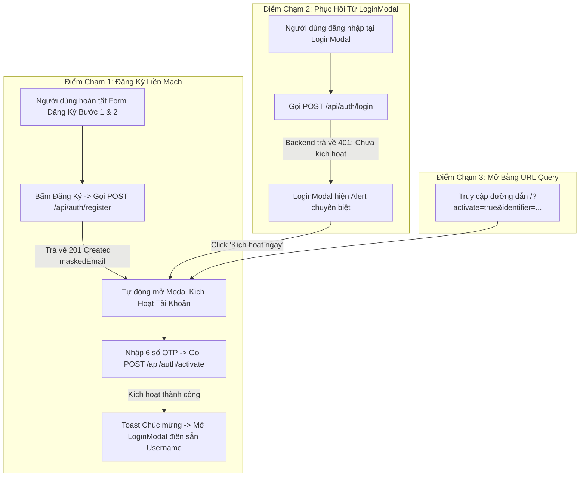

# Kế Hoạch Kỹ Thuật Chi Tiết (Technical Implementation Plan)
## TM-10: Xác Thực Email OTP, Kích Hoạt Tài Khoản & Nộp Hồ Sơ Trực Tuyến (Frontend v1.4)

> **Mã Jira Ticket:** [TM-10](https://robluccibn9935.atlassian.net/browse/TM-10) — Đăng ký tài khoản, xác thực email qua mã OTP kích hoạt và nộp hồ sơ trực tuyến  
> **Dự án phụ trách:** `InternHub-Frontend`  
> **Tài liệu Backend đối chiếu:** [`InternHub/docs/specs/TM-10-register-account-and-apply-online-spec.md`](file:///d:/codegym_final_project/InternHub/docs/specs/TM-10-register-account-and-apply-online-spec.md) (v1.4) & [`TM-10-register-account-and-apply-online-plan.md`](file:///d:/codegym_final_project/InternHub/docs/specs/TM-10-register-account-and-apply-online-plan.md)  
> **Tài liệu Frontend đối chiếu:** [`InternHub-Frontend/docs/specs/TM-10-register-account-and-apply-online-spec.md`](file:///d:/codegym_final_project/InternHub-Frontend/docs/specs/TM-10-register-account-and-apply-online-spec.md) (v1.4)  
> **Quy chuẩn bắt buộc:** 34 Nguyên tắc bất biến ([`AGENTS.md`](file:///d:/codegym_final_project/InternHub-Frontend/AGENTS.md)), Quy chuẩn UX/UI ([`08-ui-ux-guidelines.md`](file:///d:/codegym_final_project/InternHub-Frontend/.agents/08-ui-ux-guidelines.md)), Hướng dẫn thiết kế Frontend ([`frontend-design/SKILL.md`](file:///d:/codegym_final_project/InternHub-Frontend/.agents/skills/frontend-design/SKILL.md))  
> **Cấp độ thay đổi:** **L3** (Thêm Component Modal Kích hoạt, Bộ điều khiển OTP 6 ô, Hooks đếm ngược, mở rộng API Service, xử lý ngoại lệ 401 unactivated từ LoginModal)

---

## 1. Tổng Quan Kiến Trúc & Bối Cảnh Nghiệp Vụ (Architectural Context)

### 1.1. Thay Đổi Trọng Yếu Phía Backend (v1.4)
Trong phiên bản Backend v1.4, hệ thống IAM (`identity-and-access-service`) đã hoàn thành các cải tiến an ninh quan trọng:
1. **Khởi tạo trạng thái `PENDING_ACTIVATION`:** Tài khoản mới đăng ký không còn ở trạng thái `ACTIVE`.
2. **Chặn Đăng Nhập:** Gọi `POST /api/auth/login` với tài khoản `PENDING_ACTIVATION` sẽ bị từ chối với HTTP `401 Unauthorized` (*"Tài khoản chưa được kích hoạt qua email hoặc đang bị khóa"*).
3. **Mã Kích Hoạt OTP 6 Chữ Số:** Sinh ngẫu nhiên an toàn qua `SecureRandom`, có hiệu lực **15 phút**, gửi qua email HTML thông qua `reporting-and-integration-service`.
4. **An Ninh Client-Side:** Response của `/register` và `/resend-activation` **tuyệt đối không trả về mã OTP**; chỉ trả về `maskedEmail` (VD: `ngu***@gmail.com`).
5. **Chống Brute-Force & Spam Email:**
   - Mỗi mã OTP chỉ cho phép nhập sai tối đa **5 lần** (`attempt_count >= 5` thì vô hiệu hóa mã).
   - Cooldown giữa 2 lần gửi lại mã tối thiểu **60 giây** (trả về lỗi Cooldown nếu gửi quá sớm).
6. **Hai API Public Mới:**
   - `POST /api/auth/activate`: `{ "identifier": "...", "activationKey": "682941" }` $\rightarrow$ Trả về `200 OK` khi thành công.
   - `POST /api/auth/resend-activation`: `{ "identifier": "..." }` $\rightarrow$ Trả về `200 OK` kèm `cooldownSeconds: 60`.

### 1.2. Mục Tiêu Kỹ Thuật Phía Frontend
- **Loại bỏ đứt gãy luồng:** Không để xảy ra tình trạng người dùng đăng ký xong bấm đăng nhập bị văng lỗi 401 mà không hiểu lý do.
- **Tạo trải nghiệm kích hoạt đỉnh cao (State-of-the-Art OTP Experience):** Cung cấp cụm 6 ô nhập số độc lập, phát quang ánh sáng, tự động focus, điều hướng phím và dán mã trực tiếp từ clipboard.
- **Phục hồi kích hoạt thông minh (Smart Recovery Flow):** Khi người dùng đăng nhập tài khoản chưa kích hoạt tại `LoginModal`, hệ thống tự phát hiện và cung cấp nút mở thẳng Modal Kích hoạt với Username điền sẵn.

---

## 2. Ngôn Ngữ Thiết Kế & Thẩm Mỹ Frontend (Frontend Design System)
*Áp dụng trực tiếp triết lý thiết kế từ [`frontend-design/SKILL.md`](file:///d:/codegym_final_project/InternHub-Frontend/.agents/skills/frontend-design/SKILL.md)*

### 2.1. Bản Sắc Thị Giác (Subject Matter & Visual Tone)
- **Chủ đề:** Nền tảng Công nghệ Tuyển dụng & Quản trị Thực tập sinh Doanh nghiệp (Enterprise Talent Platform).
- **Cảm xúc mang lại:** Tinh tế, sắc bén, tốc độ cao, hiện đại và đáng tin cậy. Tuyệt đối tránh các màu sắc generic (đỏ/xanh cờ), tránh nền be/kem đất sét nhạt nhòa, và tránh các khối card bo góc rập khuôn của AI boilerplate.
- **Tiêu điểm táo bạo (Spend Boldness in One Place):** 
  Điểm nhấn chính là **Cụm 6 Ô Nhập OTP Dạ Quang (Interactive 6-Digit OTP Cells)**:
  - 6 ô nhập số riêng biệt kích thước $52 \times 62\text{px}$, phông số Monospace (`JetBrains Mono`/`monospace`) cỡ lớn $26\text{px}$ đậm nét.
  - Hiệu ứng quầng sáng phát quang `var(--primary-glow)` bao quanh ô đang active.
  - Phím mũi tên sang trái/phải di chuyển con trỏ mượt mà; phím Backspace tự động xóa và lùi về ô trước; **nhận diện sự kiện Paste từ Clipboard**: người dùng bấm `Ctrl+V` chuỗi 6 số từ email sẽ tự động điền đầy 6 ô trong 1 tích tắc.
  - Hiệu ứng rung nhẹ (Shake animation) khi nhập sai mã; chuyển sang viền đỏ cam cảnh báo.

### 2.2. Bảng Token Thiết Kế Ngữ Nghĩa (Design Tokens)
*Tuân thủ Quy tắc 28: 100% sử dụng CSS Variables từ [`src/index.css`](file:///d:/codegym_final_project/InternHub-Frontend/src/index.css), không hardcode mã Hex trong CSS Module:*

| Phân loại | Biến CSS Token | Giá trị Dark Mode | Giá trị Light Mode | Ứng dụng trong giao diện |
| :--- | :--- | :--- | :--- | :--- |
| **Canvas Nền** | `var(--glass-bg)` | `rgba(19, 29, 51, 0.85)` | `rgba(255, 255, 255, 0.82)` | Nền Modal kết hợp `backdrop-filter: blur(16px)` |
| **Khung Viền** | `var(--glass-border)` | `rgba(38, 53, 74, 0.8)` | `rgba(226, 232, 240, 0.8)` | Viền kính siêu mảnh bao quanh Modal |
| **Nền Ô OTP** | `var(--bg-card)` | `#131d33` | `#ffffff` | Nền từng ô số, tương phản cao |
| **Viền Mặc Định** | `var(--border-default)` | `#26354a` | `#e2e8f0` | Viền các ô chưa focus |
| **Màu Nhấn (Active)**| `var(--primary)` | `#4f46e5` | `#4f46e5` | Viền ô đang nhập và nút chính |
| **Hào Quang (Glow)**| `var(--primary-glow)` | `rgba(79, 70, 229, 0.35)`| `rgba(79, 70, 229, 0.25)` | Đổ bóng ánh sáng xung quanh ô active |
| **Trạng Thái Sai** | `var(--danger)` / `bg` | `#ef4444` / `var(--danger-bg)` | `#ef4444` / `#fef2f2` | Cảnh báo sai mã, rung ô, khóa mã |
| **Trạng Thái Chờ** | `var(--warning)` / `bg` | `#f59e0b` / `var(--warning-bg)`| `#f59e0b` / `#fffbeb` | Cảnh báo số lần thử còn lại $\le 2$ |
| **Thành Công** | `var(--success)` / `bg` | `#10b981` / `var(--success-bg)`| `#10b981` / `#ecfdf5` | Kích hoạt thành công, dấu tick xanh |

### 2.3. Bản Vẽ Wireframe ASCII (UI Layout Blueprint)

```
+-------------------------------------------------------------------------+
| [Icon Khiên Bảo Mật] KÍCH HOẠT TÀI KHOẢN THỰC TẬP SINH              [X] |
| Mã xác thực gồm 6 chữ số đã được gửi đến: ngu***@gmail.com              |
+-------------------------------------------------------------------------+
|                                                                         |
|  [Hộp Thông Báo Thân Thiện: Vui lòng kiểm tra hộp thư đến hoặc thư rác] |
|                                                                         |
|                 +----+  +----+  +----+  +----+  +----+  +----+          |
|                 | 6  |  | 8  |  | 2  |  | 9  |  | 4  |  | 1  |          |
|                 +----+  +----+  +----+  +----+  +----+  +----+          |
|                 (--- Cụm 6 ô nhập số độc lập, phát quang khi focus ---) |
|                                                                         |
|  [Đồng hồ đếm ngược]: Mã có hiệu lực trong: 14:32                       |
|  [Cảnh báo nếu sai]: Mã kích hoạt không đúng. Bạn còn 3 lần thử.        |
|                                                                         |
|  Bạn chưa nhận được mã qua email?                                       |
|  [ Nút: Gửi lại mã kích hoạt (48s) ] (Đếm ngược Cooldown 60s)           |
|                                                                         |
+-------------------------------------------------------------------------+
| [ <- Quay lại Đăng Ký ]               [ Nút: Xác Thực & Kích Hoạt -> ] |
|                                       (Chỉ bật sáng khi đủ 6 chữ số)    |
+-------------------------------------------------------------------------+
```

---

## 3. Kiến Trúc Luồng Người Dùng & 3 Điểm Chạm (3 Smart Entry Points)



---

## 4. Chi Tiết Thành Phần Triển Khai (Component & Service Breakdown)

Tuân thủ nghiêm ngặt **34 Nguyên tắc Bất biến** tại [`AGENTS.md`](file:///d:/codegym_final_project/InternHub-Frontend/AGENTS.md):

### 4.1. Tầng Constants & Types (Quy Tắc 17 & 19 - Không Dùng Magic Strings)
1. **[MODIFY] [`src/constants/endpoints/auth.endpoints.ts`](file:///d:/codegym_final_project/InternHub-Frontend/src/constants/endpoints/auth.endpoints.ts)**:
   ```typescript
   export const AUTH_ENDPOINTS = {
     LOGIN: '/api/auth/login',
     REGISTER: '/api/auth/register',
     ACTIVATE: '/api/auth/activate',             // [NEW v1.4]
     RESEND_ACTIVATION: '/api/auth/resend-activation', // [NEW v1.4]
     ME: '/api/auth/me',
     REFRESH: '/api/auth/refresh',
     LOGOUT: '/api/auth/logout',
   } as const;
   ```
2. **[MODIFY] [`src/types/auth.types.ts`](file:///d:/codegym_final_project/InternHub-Frontend/src/types/auth.types.ts)**:
   - Mở rộng `RegisterResponse`: bổ sung `maskedEmail?: string;`
   - Bổ sung `ActivateAccountRequest`:
     ```typescript
     export interface ActivateAccountRequest {
       identifier: string;    // email hoặc username
       activationKey: string; // 6 chữ số
     }
     ```
   - Bổ sung `ResendActivationRequest`:
     ```typescript
     export interface ResendActivationRequest {
       identifier: string;    // email hoặc username
     }
     ```
   - Bổ sung `ResendActivationResponse`:
     ```typescript
     export interface ResendActivationResponse {
       maskedEmail: string;
       expiresInMinutes?: number;
       cooldownSeconds?: number;
     }
     ```

### 4.2. Tầng Service (Quy Tắc 18 - Axios 4 Tầng Hỗ Trợ AbortSignal)
3. **[MODIFY] [`src/services/authService.ts`](file:///d:/codegym_final_project/InternHub-Frontend/src/services/authService.ts)**:
   - Bổ sung phương thức `activateAccount(data: ActivateAccountRequest, signal?: AbortSignal): Promise<void>`:
     ```typescript
     async activateAccount(data: ActivateAccountRequest, signal?: AbortSignal): Promise<void> {
       await apiClient.post(API_ENDPOINTS.AUTH.ACTIVATE, data, { signal });
     }
     ```
   - Bổ sung phương thức `resendActivation(data: ResendActivationRequest, signal?: AbortSignal): Promise<ResendActivationResponse>`:
     ```typescript
     async resendActivation(data: ResendActivationRequest, signal?: AbortSignal): Promise<ResendActivationResponse> {
       const response = await apiClient.post(API_ENDPOINTS.AUTH.RESEND_ACTIVATION, data, { signal });
       return response.data?.data;
     }
     ```

### 4.3. Tầng Custom Hooks (Quy Tắc 14 - Giới Hạn State Trong Component $\le 3-4$)
4. **[NEW] [`src/hooks/useOtpInput.ts`](file:///d:/codegym_final_project/InternHub-Frontend/src/hooks/useOtpInput.ts)**:
   - Quản lý mảng 6 ký tự số `digits: string[]` (`['', '', '', '', '', '']`).
   - Xử lý sự kiện `handleChange(index, value)`: chỉ nhận ký tự số, tự động nhảy focus sang ô kế tiếp.
   - Xử lý sự kiện `handleKeyDown(index, e)`: hỗ trợ `Backspace` (xóa và lùi về ô trước), `ArrowLeft`/`ArrowRight`.
   - Xử lý sự kiện `handlePaste(e)`: trích xuất chuỗi dán từ clipboard, lọc chỉ lấy 6 chữ số đầu tiên và điền đồng loạt vào 6 ô.
   - Trả về: `{ digits, otpValue, isComplete, inputRefs, handleChange, handleKeyDown, handlePaste, clearOtp, focusFirst }`.
5. **[NEW] [`src/hooks/useOtpCountdown.ts`](file:///d:/codegym_final_project/InternHub-Frontend/src/hooks/useOtpCountdown.ts)**:
   - Quản lý đồng hồ đếm ngược thời gian hết hạn mã OTP (15 phút = 900 giây).
   - Quản lý đồng hồ đếm ngược Cooldown nút gửi lại mã (60 giây).
   - Lưu trữ mốc thời gian vào `sessionStorage` để không bị reset khi người dùng reload trang.
   - Trả về: `{ expirySeconds, formattedExpiry, isExpired, cooldownSeconds, isCooldownActive, startCooldown, resetExpiry }`.

### 4.4. Tầng Giao Diện UI & Subcomponents (Quy Tắc 12, 13, 23, 29, 30, 33)
6. **[NEW] [`src/components/auth/OtpInput/OtpInput.tsx`](file:///d:/codegym_final_project/InternHub-Frontend/src/components/auth/OtpInput/OtpInput.tsx)**:
   - Component chuyên trách hiển thị 6 ô nhập số độc lập.
   - Đi kèm file props interface riêng `OtpInput.types.ts` (Quy tắc 13).
   - CSS Module `OtpInput.module.css` sử dụng tokens `var(--primary-glow)`, `var(--border-default)`, `var(--bg-card)` (Quy tắc 23 & 28).
   - Hỗ trợ đầy đủ Accessibility: `aria-label="Chữ số OTP {index + 1}"`, `inputMode="numeric"`, `autoComplete="one-time-code"`.
7. **[NEW] [`src/components/auth/AccountActivationModal.tsx`](file:///d:/codegym_final_project/InternHub-Frontend/src/components/auth/AccountActivationModal.tsx)**:
   - Modal kích hoạt tài khoản độc lập, tuân thủ cấu trúc 3 khối bảo toàn ngữ cảnh (Quy tắc 29):
     - **Header cố định:** Icon ShieldCheck, Tiêu đề, Subtitle hiển thị `maskedEmail`.
     - **Body cuộn:** Hộp thông báo email, Component `OtpInput`, Đồng hồ đếm ngược 15m, Cảnh báo số lần thử còn lại, Nút gửi lại mã kèm Cooldown 60s.
     - **Sticky Footer cố định:** Nút Quay lại và Nút *"Xác Thực & Kích Hoạt"* (chỉ active khi đủ 6 ký tự, có Spinner khi submitting - Quy tắc 24).
   - Đi kèm file props interface riêng `AccountActivationModal.types.ts`.
   - CSS Module `AccountActivationModal.module.css`.
8. **[MODIFY] [`src/components/auth/RegisterModal.tsx`](file:///d:/codegym_final_project/InternHub-Frontend/src/components/auth/RegisterModal.tsx)**:
   - Sau khi `authService.register()` trả về `201 Created`:
     - Nhận về `res.maskedEmail` và `res.username`.
     - Kích hoạt callback mở `AccountActivationModal` với `identifier` và `maskedEmail`.
9. **[MODIFY] [`src/components/auth/LoginModal.tsx`](file:///d:/codegym_final_project/InternHub-Frontend/src/components/auth/LoginModal.tsx)**:
   - Bắt lỗi HTTP 401 khi tài khoản chưa kích hoạt (`err.message.includes('chưa được kích hoạt')`).
   - Hiển thị khối `Alert` dạng `warning` kèm nút CTA: *"Tài khoản chưa kích hoạt? Bấm vào đây để nhập mã OTP kích hoạt ngay"*.
   - Click nút sẽ đóng LoginModal và mở thẳng `AccountActivationModal` với Username điền sẵn.
10. **[MODIFY] [`src/pages/public/LandingPage.tsx`](file:///d:/codegym_final_project/InternHub-Frontend/src/pages/public/LandingPage.tsx)**:
    - Quản lý state mở/đóng `AccountActivationModal`.
    - Điều phối chuỗi chuyển tiếp: Đăng ký thành công $\rightarrow$ Mở Kích hoạt $\rightarrow$ Kích hoạt thành công $\rightarrow$ Mở Đăng nhập.
    - Hỗ trợ URL query param `?activate=true&identifier=...`.

---

## 5. Bảng Quản Lý Rủi Ro & Xử Lý Ngoại Lệ (Edge Cases & Mitigations)

| STT | Tình huống ngoại lệ (Edge Case) | Rủi ro UX / Hệ thống | Giải pháp thiết kế & Xử lý Frontend |
| :---: | :--- | :--- | :--- |
| **1** | Nhập sai mã OTP (Backend trả về 400 kèm số lần còn lại) | Người dùng bối rối không biết còn bao nhiêu cơ hội trước khi bị khóa | Bắt message từ API (VD: *"Bạn còn 3 lần thử"*), kích hoạt hiệu ứng rung lắc (Shake) ở 6 ô OTP, đổi viền sang đỏ/cam, focus lại ô đầu tiên và hiện Alert cảnh báo. |
| **2** | Nhập sai quá 5 lần (Brute-force limit reached) | Mã bị vô hiệu hóa hoàn toàn trong DB | Khóa tương tác 6 ô OTP (`disabled`), hiển thị Alert lỗi nghiêm trọng màu đỏ: *"Mã kích hoạt đã bị khóa do nhập sai quá 5 lần. Vui lòng bấm 'Gửi lại mã' để nhận mã mới."*, kích hoạt hiệu ứng pulse nút gửi lại mã. |
| **3** | Mã OTP hết hạn (Quá 15 phút) | Người dùng bấm xác thực bị lỗi 400 hết hạn | Đồng hồ đếm ngược tự chuyển sang màu đỏ `00:00 - Hết hạn`, khóa nút Xác thực, làm nổi bật nút CTA yêu cầu cấp mã mới. |
| **4** | Spam bấm nút "Gửi lại mã" liên tục | Bị Backend chặn với lỗi 400/429 Cooldown 60s | Khóa nút gửi lại kèm chữ *"Gửi lại mã (XXs)"*, áp dụng đếm ngược Cooldown 60s ở Client, chỉ cho phép bấm lại khi đếm về 0. |
| **5** | Người dùng dán mã OTP từ email (`Ctrl+V`) | Giao diện thông thường chỉ dán được vào 1 ô duy nhất | Bắt sự kiện `onPaste` tại container: Tự động trích xuất chuỗi, làm sạch khoảng trắng, lấy 6 chữ số và gán vào 6 ô tức thì, tự động kích hoạt validate. |
| **6** | Người dùng vô tình đóng modal kích hoạt hoặc reload trang | Mất phiên kích hoạt, không đăng nhập được | Hỗ trợ mở lại dễ dàng từ `LoginModal` (nhập user báo chưa kích hoạt sẽ có nút mở lại) hoặc qua URL `/?activate=true&identifier=...`. |
| **7** | Double-Click khi bấm Kích hoạt hoặc Gửi lại | Gửi trùng 2 request làm tăng attempt count hoặc lỗi Cooldown | Đặt cờ `isSubmitting = true`, khóa toàn bộ tương tác (`pointer-events: none`) và hiển thị loader spinner xoay tròn. |

---

## 6. Kế Hoạch Kiểm Thử & Nghiệm Thu (Verification Checklist)

### 6.1. Kiểm thử Tương tác Giao diện (UI/UX Verification)
- [ ] Mở `RegisterModal`, hoàn tất Bước 1 & 2 $\rightarrow$ Bấm Đăng ký $\rightarrow$ Modal Kích hoạt xuất hiện tức thì với `maskedEmail` chuẩn xác.
- [ ] Gõ từng chữ số vào ô OTP $\rightarrow$ Con trỏ tự nhảy mượt mà sang ô tiếp theo.
- [ ] Bấm phím `Backspace` $\rightarrow$ Xóa ký tự hiện tại và tự lùi về ô trước.
- [ ] Copy chuỗi `682941` từ clipboard và bấm `Ctrl+V` $\rightarrow$ Toàn bộ 6 ô được điền đầy đủ và chính xác.
- [ ] Nút "Xác Thực & Kích Hoạt" chỉ sáng lên khi đủ 6 ký tự.

### 6.2. Kiểm thử Tích hợp API (Integration Verification)
- [ ] Nhập sai mã OTP $\rightarrow$ Nhận phản hồi thông báo số lần thử còn lại, có hiệu ứng rung cảnh báo.
- [ ] Nhập sai quá 5 lần $\rightarrow$ Bị khóa mã, hiển thị yêu cầu gửi lại mã.
- [ ] Bấm "Gửi lại mã kích hoạt" $\rightarrow$ Gọi `POST /api/auth/resend-activation`, bắt đầu đếm ngược 60s, nút bị khóa.
- [ ] Nhập đúng mã OTP $\rightarrow$ Nhận phản hồi thành công, hiển thị Toast xanh, tự động chuyển về `LoginModal` với username đã được điền sẵn.
- [ ] Đăng nhập với tài khoản vừa kích hoạt $\rightarrow$ Đăng nhập thành công vào hệ thống.
- [ ] Đăng nhập với tài khoản chưa kích hoạt $\rightarrow$ `LoginModal` hiển thị Alert cảnh báo kèm nút "Kích hoạt ngay".

### 6.3. Kiểm thử Kỹ thuật (Code Quality & Build)
- [ ] Chạy kiểm tra TypeScript: `npm run build` hoặc `tsc -b` không có bất kỳ lỗi biên dịch nào.
- [ ] Chạy linter: `oxlint` không có cảnh báo vi phạm.
- [ ] Đảm bảo 100% biến màu dùng CSS tokens (`var(--...)`), không có mã hex hardcode trong CSS modules.

---

## 7. Trình Tự Thực Hiện Chi Tiết Theo Giai Đoạn (Phased Execution Steps)

```
[Phase 1: Foundation Layer]
  ├── T-6.1: Khai báo endpoint ACTIVATE, RESEND_ACTIVATION trong auth.endpoints.ts
  ├── T-6.2: Khai báo DTOs ActivateAccountRequest, ResendActivationRequest trong auth.types.ts
  └── T-6.3: Cài đặt activateAccount, resendActivation trong authService.ts

[Phase 2: Hooks & Subcomponents]
  ├── T-6.4: Xây dựng useOtpInput.ts (phím số, backspace, arrows, paste clipboard)
  ├── T-6.5: Xây dựng useOtpCountdown.ts (đếm ngược 15m TTL & 60s cooldown)
  └── T-6.6: Xây dựng component OtpInput.tsx + types + CSS Module phát quang

[Phase 3: Core Activation Modal]
  ├── T-6.7: Xây dựng AccountActivationModal.tsx + types + CSS Module (chuẩn 3 khối)
  ├── T-6.8: Tích hợp cảnh báo Brute-force telemetry và khóa mã sau 5 lần sai
  └── T-6.9: Tích hợp đồng hồ đếm ngược kép và nút gửi lại mã có cooldown

[Phase 4: Flow Integration]
  ├── T-6.10: Nối luồng RegisterModal ➔ AccountActivationModal
  ├── T-6.11: Nối luồng LoginModal bắt lỗi 401 ➔ Mở AccountActivationModal
  └── T-6.12: Cập nhật LandingPage.tsx quản lý state và hỗ trợ URL query ?activate=true

[Phase 5: Verification & Polish]
  ├── T-6.13: Kiểm thử tương tác Responsive Mobile & Desktop
  ├── T-6.14: Kiểm tra build TypeScript (tsc -b) & Linter (oxlint)
  └── T-6.15: Cập nhật tài liệu spec & plan trong docs/specs/
```
