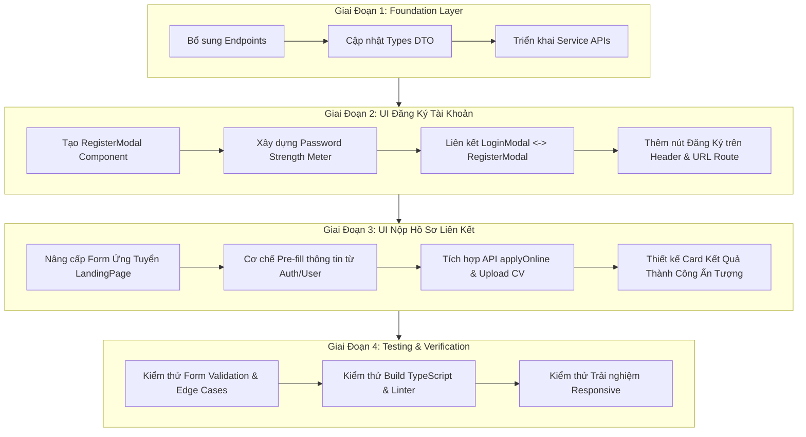

# Specification: Đăng Ký Tài Khoản và Nộp Hồ Sơ Trực Tuyến (TM-10)

> **Tài liệu Đặc Tả Kỹ Thuật Giao Diện & Luồng Nghiệp Vụ (Frontend Specification)**  
> **Dự án:** `InternHub-Frontend`  
> **Mã Jira Ticket:** [TM-10](https://robluccibn9935.atlassian.net/browse/TM-10) - Đăng ký tài khoản và nộp hồ sơ trực tuyến (Account Registration & Online Application)  
> **Tài liệu Backend tham chiếu:** [`InternHub/docs/specs/TM-10-register-account-and-apply-online-spec.md`](file:///d:/codegym_final_project/InternHub/docs/specs/TM-10-register-account-and-apply-online-spec.md) (Commit `b31c1c5`, PR `#27`)  
> **Nhánh Git dự kiến:** `feature/TM-10/register-account-and-apply-online-ui` (tách từ `develop`)  
> **Change Level:** **L3** (Mở rộng UI Auth Modals, Form Đăng Ký 2 khối, Thanh đo độ mạnh mật khẩu, Form Ứng Tuyển tích hợp liên kết định danh `userId`, Service APIs, DTO Types & Router)  
> **Tiêu chuẩn tuân thủ:** 34 Nguyên tắc bất biến ([`AGENTS.md`](file:///d:/codegym_final_project/InternHub-Frontend/AGENTS.md)), Quy chuẩn UX/UI ([`08-ui-ux-guidelines.md`](file:///d:/codegym_final_project/InternHub-Frontend/.agents/08-ui-ux-guidelines.md)), Hướng dẫn phát triển ([`04-development-guide.md`](file:///d:/codegym_final_project/InternHub-Frontend/.agents/04-development-guide.md)), và Hướng dẫn thiết kế Frontend ([`frontend-design/SKILL.md`](file:///d:/codegym_final_project/InternHub-Frontend/.agents/skills/frontend-design/SKILL.md))

---

## 0. Nhật Ký Thay Đổi & Giải Trình Kỹ Thuật (Revision History & Change Rationale)

| Phiên bản | Ngày | Người thực hiện | Task / Jira | Loại thay đổi | Lý do & Giải trình kỹ thuật (Rationale) |
| :---: | :---: | :---: | :---: | :---: | :--- |
| **v1.0** | 2026-09-25 | Senior Frontend AI Pair-Programmer | `TM-10` | Tạo mới Spec Frontend | Khởi tạo tài liệu đặc tả toàn diện cho giao diện Đăng ký tài khoản và Nộp hồ sơ trực tuyến có liên kết định danh người dùng (`userId`), đồng bộ với Backend TM-10 đã merge. |
| **v1.1** | 2026-09-25 | Senior Frontend AI Pair-Programmer | `TM-10` | Tái cấu trúc UX/UI Wizard 2 Bước | Chuyển đổi Form Đăng ký sang quy trình Stepper Wizard 2 bước (Bước 1: Thiết lập tài khoản & đo độ mạnh mật khẩu; Bước 2: Điền thông tin cá nhân liên kết) giúp giảm tải nhận thức và tối ưu hóa trải nghiệm người dùng trên cả Mobile và Desktop. |
| **v1.2** | 2026-09-25 | Senior Frontend AI Pair-Programmer | `TM-10` | Tái cấu trúc Luồng Nộp Hồ Sơ Chuyên Sâu | Chuyển form nộp hồ sơ từ Landing Page sang route chuyên trách `/intern/apply` (`InternApplyPage`) với thông tin cá nhân điền sẵn từ tài khoản; nâng cấp `InternDashboard` với `InternEmptyState` (Onboarding Hero) khi intern chưa nộp hồ sơ; thay form Landing Page bằng Vị trí tuyển dụng và CTA thông minh. |

---

## 1. Feature Overview (Tổng Quan Tính Năng)

- **Tên tính năng:** Đăng Ký Tài Khoản & Nộp Hồ Sơ Thực Tập Trực Tuyến (Account Registration & Seamless Application Submission).
- **Hệ thống liên quan:**
  - **Frontend:** `InternHub-Frontend` (React 19, TypeScript, Vite 6, TailwindCSS v4, React Router DOM v7, React Hook Form, Zod, TanStack Query v5, Lucide React, Sonner Toast).
  - **Backend Services:**
    - `identity-and-access-service` (Port 8081): Tiếp nhận Composite Object đăng ký, bóc tách lưu `users` $\rightarrow$ `accounts` với vai trò `ROLE_INTERN`.
    - `intern-and-program-service` (Port 8082): Tiếp nhận hồ sơ trực tuyến gắn `userId`, cấp mã `INT-YYYY-XXXX`, trạng thái `PENDING`, hỗ trợ upload đính kèm CV.
    - `api-gateway` (Port 8080): Định tuyến public `/api/auth/register` và `/api/interns/apply`.
- **Đối tượng người dùng (Target Users):**
  - **Ứng viên / Sinh viên vãng lai (`GUEST`):** Đăng ký tài khoản mới dễ dàng, nộp hồ sơ thực tập trực tuyến và đính kèm CV ngay trên cổng thông tin.
  - **Thực tập sinh đã có tài khoản (`ROLE_INTERN`):** Đăng nhập vào hệ thống, xem thông tin đã được tự động điền sẵn để nộp hồ sơ ứng tuyển vị trí mới hoặc bổ sung tài liệu.

---

## 2. Business Goal & Core Objectives (Mục Tiêu Nghiệp Vụ)

1. **Trải nghiệm đăng ký một chạm (Single Composite Form Payload):**
   - Form Đăng ký thu thập thông tin tài khoản và thông tin cá nhân trong cùng một luồng trực quan, gửi một payload duy nhất lên `POST /api/auth/register`.
2. **Hỗ trợ người dùng với Thanh đo độ mạnh mật khẩu (Password Strength Meter):**
   - Trực quan hóa quy tắc mật khẩu doanh nghiệp (tối thiểu 8 ký tự, chữ hoa, chữ thường, số, ký tự đặc biệt) theo thời gian thực giúp giảm thiểu tỷ lệ submit lỗi 400.
3. **Luồng liền mạch không đứt gãy (Seamless Onboarding Journey):**
   - Đăng ký thành công $\rightarrow$ Tự động đăng nhập / lưu session $\rightarrow$ Chuyển tiếp mượt mà sang form Nộp hồ sơ ứng tuyển với các trường cá nhân (`fullName`, `email`, `phone`, `dateOfBirth`, `gender`, `address`) được tự động điền sẵn (pre-fill).
4. **Liên kết định danh chính xác (`userId`):**
   - Nộp hồ sơ qua `POST /api/interns/apply` gửi kèm `userId` định danh, giúp ứng viên sau đó có thể đăng nhập cổng nội bộ để theo dõi tiến độ thẩm định, lịch phỏng vấn và lộ trình đào tạo.
5. **Trực quan hóa thành công ấn tượng (High-Value Confirmation):**
   - Sau khi nộp hồ sơ, cấp ngay thẻ thông tin hiển thị Mã TTS dạng `INT-2026-XXXX`, trạng thái `PENDING`, cảnh báo bảo mật và nút hành động nhanh điều hướng vào Cổng thông tin thực tập sinh.

---

## 3. Scope of Work (Phạm Vi Công Việc)

### 3.1. Trong phạm vi (In Scope)

1. **Cập nhật Cấu Trúc Hằng Số & DTO Layer:**
   - Bổ sung `INTERN_ENDPOINTS.APPLY = '/api/interns/apply'` vào [`src/constants/endpoints/intern.endpoints.ts`](file:///d:/codegym_final_project/InternHub-Frontend/src/constants/endpoints/intern.endpoints.ts).
   - Đảm bảo `AUTH_ENDPOINTS.REGISTER = '/api/auth/register'` trong [`src/constants/endpoints/auth.endpoints.ts`](file:///d:/codegym_final_project/InternHub-Frontend/src/constants/endpoints/auth.endpoints.ts).
   - Cập nhật types trong [`src/types/auth.types.ts`](file:///d:/codegym_final_project/InternHub-Frontend/src/types/auth.types.ts) chuẩn hóa DTO: `RegisterRequest` (sử dụng `phoneNumber`, không chứa `role`) và `RegisterResponse`.
   - Cập nhật types trong [`src/types/intern.types.ts`](file:///d:/codegym_final_project/InternHub-Frontend/src/types/intern.types.ts): thêm `ApplyInternRequest`, mở rộng `InternProfile` có trường `userId`.
2. **Cập nhật Tầng Service (`services/`):**
   - Mở rộng [`authService.ts`](file:///d:/codegym_final_project/InternHub-Frontend/src/services/authService.ts): Thêm hàm `register(data: RegisterRequest): Promise<RegisterResponse>`.
   - Mở rộng [`internService.ts`](file:///d:/codegym_final_project/InternHub-Frontend/src/services/internService.ts): Thêm hàm `applyOnline(data: ApplyInternRequest): Promise<InternProfile>`.
3. **Phát triển UI Component `RegisterModal`:**
   - Xây dựng component [`RegisterModal.tsx`](file:///d:/codegym_final_project/InternHub-Frontend/src/components/auth/RegisterModal.tsx) tuân thủ cấu trúc 3 khối, hỗ trợ chuyển đổi qua lại mượt mà với [`LoginModal.tsx`](file:///d:/codegym_final_project/InternHub-Frontend/src/components/auth/LoginModal.tsx).
   - Bố cục 2 khối thông tin:
     - Khối A: Tài khoản (`username`, `password`, `confirmPassword`, hiển thị thanh tiến độ độ mạnh mật khẩu và mắt ẩn/hiện mật khẩu).
     - Khối B: Cá nhân (`fullName`, `email`, `phoneNumber`, `dateOfBirth`, `gender`, `address`).
   - Tích hợp Zod Validation Schema và React Hook Form.
4. **Cập nhật `LoginModal` & Điều Hướng Header:**
   - Thêm nút liên kết: *"Chưa có tài khoản? Đăng ký tài khoản thực tập sinh"* tại chân `LoginModal`.
   - Thêm nút *"Đăng Ký"* nổi bật trên Header trang Landing Page.
   - Hỗ trợ URL query `?register=true` để mở thẳng modal đăng ký khi truy cập từ đường dẫn bên ngoài.
5. **Nâng cấp Luồng Nộp Hồ Sơ Trực Tuyến tại `LandingPage.tsx`:**
   - Tích hợp gọi API `internService.applyOnline()` thay vì `createIntern()` cũ.
   - Nhận diện trạng thái đăng nhập: Nếu người dùng đã đăng nhập hoặc vừa đăng ký xong, tự động điền sẵn thông tin cá nhân và truyền `userId`.
   - Tích hợp tải lên CV đính kèm qua `documentService.uploadDocument(internCode, file, 'CV')`.
   - Hiển thị Banner kết quả thành công chứa Mã Thực Tập Sinh và nút chuyển tới Cổng nội bộ.

### 3.2. Ngoài phạm vi (Out of Scope)

- Không gửi email xác thực kích hoạt tài khoản OTP (Backend tự kích hoạt `ACTIVE`).
- Không bao gồm logic phê duyệt / từ chối hồ sơ của cán bộ nhân sự HR (thuộc phạm vi TM-11).
- Không sửa đổi mã nguồn Backend Java đã được đóng gói và kiểm thử ở commit `b31c1c5`.

---

## 4. Potential Logic Loopholes & Mitigations (Edge Cases & Xử Lý Ngoại Lệ)

| STT | Tình huống ngoại lệ (Edge Case) | Rủi ro kỹ thuật / UX | Giải pháp thiết kế & Xử lý Frontend |
| :---: | :--- | :--- | :--- |
| **1** | Trùng lặp Username, Email hoặc SĐT (Backend trả về HTTP 409 Conflict) | Người dùng bối rối nếu modal đóng lại hoặc thông báo chung chung | Bắt mã lỗi 409 từ Axios interceptor, giữ nguyên toàn bộ dữ liệu đã nhập trong form, hiển thị thông báo Alert lỗi màu đỏ nổi bật ở đầu form giải thích rõ ràng trường bị trùng. |
| **2** | Mật khẩu không đủ mạnh theo chính sách BR-3 | Backend quăng lỗi 400 Bad Request làm gián đoạn luồng submit | Xây dựng thanh `PasswordStrengthMeter` ngay dưới ô mật khẩu: Kiểm tra realtime 4 tiêu chí (Độ dài $\ge 8$, chữ hoa, chữ thường, số, ký tự đặc biệt). Khóa nút Đăng ký khi mật khẩu chưa đạt yêu cầu. |
| **3** | Mật khẩu xác nhận (`confirmPassword`) không khớp | Dữ liệu gửi lên sai lệch gây trải nghiệm kém | Client-side validation qua Zod `.refine()`: Hiển thị thông báo đỏ ngay dưới ô xác nhận mật khẩu *"Mật khẩu xác nhận không trùng khớp"*. |
| **4** | Đăng ký thành công nhưng tạo hồ sơ ứng tuyển thất bại | Tài khoản đã tạo xong nhưng hồ sơ chưa lưu | Lưu phiên đăng nhập ngay khi đăng ký thành công (Token & User), hiển thị thông báo: *"Tài khoản đã tạo thành công! Hãy hoàn tất nộp hồ sơ ứng tuyển của bạn"*, giữ lại thông tin form để ứng viên bấm nộp lại mà không phải đăng ký lại. |
| **5** | Đã có hồ sơ đang xử lý (`PENDING`/`IN_PROGRESS`) nộp tiếp | Backend trả về 400: *"Bạn đã có một hồ sơ đang chờ xét duyệt..."* | Bắt lỗi 400, hiển thị Banner cảnh báo kèm nút dẫn đến Cổng tra cứu: *"Bạn đã có hồ sơ đang xử lý. Bấm vào đây để theo dõi tiến độ"*. |
| **6** | Double-Click khi Submit Đăng ký hoặc Nộp hồ sơ | Gửi 2 request đồng thời gây lỗi xung đột 409 hoặc duplicate | Đặt state `isSubmitting = true`, vô hiệu hóa nút bấm (`disabled`), đổi icon sang Spinner quay tròn, ngăn chặn toàn bộ thao tác click lặp lại. |
| **7** | Kích thước file CV vượt quá giới hạn (VD: > 10MB) hoặc sai định dạng | Upload thất bại hoặc timeout | Kiểm tra file client-side trước khi upload: Giới hạn dung lượng tối đa 10MB, chỉ cho phép định dạng `.pdf`, `.doc`, `.docx`. Cảnh báo ngay khi người dùng chọn file. |

---

## 5. Functional Requirements (Yêu Cầu Chức Năng)

- **FR-1 (Open Registration Trigger):** Người dùng có thể mở Form Đăng ký từ nút "Đăng Ký" trên Header Landing Page, từ liên kết chân trang của `LoginModal`, hoặc qua URL `/?register=true`.
- **FR-2 (Two-Column / Tabbed Form Layout):** Form Đăng ký bố trí trực quan 2 khối dữ liệu rõ ràng:
  - Thông tin đăng nhập: Tên đăng nhập (4-50 ký tự), Mật khẩu, Xác nhận mật khẩu.
  - Thông tin định danh cá nhân: Họ và tên, Email, Số điện thoại (10 chữ số), Ngày sinh, Giới tính, Địa chỉ cư trú.
- **FR-3 (Interactive Password Validator):** Hiển thị trực quan trạng thái đạt/chưa đạt của 4 điều kiện bảo mật mật khẩu kèm thanh màu (Yếu - Vàng / Trung bình - Xanh nhạt / Mạnh - Xanh lá).
- **FR-4 (Submit Registration Request):** Gửi đối tượng Composite JSON hợp lệ đến `POST /api/auth/register`, hiển thị trạng thái loading spinner trong lúc chờ phản hồi.
- **FR-5 (Auto-Login & Session Preservation):** Sau khi đăng ký thành công:
  - Nếu API trả về token: Tự động lưu session và cập nhật `AuthContext`.
  - Nếu API trả về dữ liệu user: Tự động lưu tạm định danh `userId` và điều hướng mượt mà đến vùng nộp hồ sơ ứng tuyển.
- **FR-6 (Pre-fill Application Form):** Form Nộp hồ sơ tự động lấy họ tên, email, số điện thoại, ngày sinh, địa chỉ từ tài khoản vừa đăng ký/đã đăng nhập đưa vào các ô input, cho phép ứng viên chỉ cần tập trung điền thông tin học vấn và đính kèm CV.
- **FR-7 (Submit Online Application):** Gửi thông tin hồ sơ đến `POST /api/interns/apply` kèm `userId`.
- **FR-8 (Attach Resume / CV Document):** Nếu có file CV được chọn, tự động gọi tiếp `POST /api/interns/{internCode}/documents` với loại tài liệu `CV`.
- **FR-9 (Success State & Code Presentation):** Trình bày màn hình thành công nổi bật với Mã TTS (`INT-YYYY-XXXX`), trạng thái `PENDING`, lời cảm ơn và các nút hành động tiếp theo.

---

## 6. Business Rules & Validation Constraints (Quy Tắc Nghiệp Vụ)

- **BR-1 (Username Policy):** Độ dài từ 4 đến 50 ký tự, chỉ bao gồm chữ cái, chữ số và dấu gạch dưới (`^[a-zA-Z0-9_]{4,50}$`).
- **BR-2 (Password Policy):** Tối thiểu 8 ký tự, phải chứa ít nhất 1 chữ in hoa (`A-Z`), 1 chữ in thường (`a-z`), 1 chữ số (`0-9`) và 1 ký tự đặc biệt (`[@$!%*?&#]`).
- **BR-3 (Contact Uniqueness):** Email phải đúng định dạng RFC 5322; Số điện thoại phải là số di động Việt Nam gồm 10 chữ số (`^(0[3|5|7|8|9])[0-9]{8}$`).
- **BR-4 (Role Assignment):** Toàn bộ tài khoản đăng ký từ Client mặc định nhận vai trò `ROLE_INTERN` (không cho phép client can thiệp trường `role`).
- **BR-5 (Single Active Application):** Mỗi ứng viên chỉ được có tối đa 1 hồ sơ ở trạng thái `PENDING` hoặc `INTERNING`. Nếu đã có hồ sơ chưa hoàn tất, hệ thống từ chối nộp hồ sơ mới.
- **BR-6 (Supported Resume Formats):** Tệp tin CV đính kèm chỉ chấp nhận định dạng `.pdf`, `.doc`, `.docx` với dung lượng $\le 10\text{MB}$.

---

## 7. Data Models & API Contract (Giao Thức Dữ Liệu)

### 7.1. Cấu trúc TypeScript Interfaces

```typescript
// src/types/auth.types.ts
export interface RegisterRequest {
  username: string;
  password: string;
  fullName: string;
  email: string;
  phoneNumber: string; // Chú ý: Backend dùng phoneNumber
  dateOfBirth?: string; // Định dạng yyyy-MM-dd
  gender?: 'MALE' | 'FEMALE' | 'OTHER';
  address?: string;
  avatarUrl?: string;
}

export interface RegisterResponse {
  userId: number;
  username: string;
  fullName: string;
  email: string;
  role: string;
  status: string;
}

// src/types/intern.types.ts
export interface ApplyInternRequest {
  userId?: number;
  fullName: string;
  email: string;
  phone: string;
  dateOfBirth?: string;
  gender?: 'MALE' | 'FEMALE' | 'OTHER';
  address?: string;
  university: string;
  major: string;
  academicYear?: string;
  appliedPosition: string;
  startDate: string;
  notes?: string;
}
```

### 7.2. Chi Tiết Endpoints

| Chức năng | Phương thức | Endpoint URL | Xác thực | Payload |
| :--- | :---: | :--- | :---: | :--- |
| **Đăng ký tài khoản** | `POST` | `/api/auth/register` | Public | `RegisterRequest` (Composite JSON) |
| **Nộp hồ sơ ứng tuyển** | `POST` | `/api/interns/apply` | Public / Bearer | `ApplyInternRequest` |
| **Tải lên CV đính kèm** | `POST` | `/api/interns/{internCode}/documents` | Public / Bearer | `multipart/form-data` (`file`, `documentType: 'CV'`) |

---

## 8. UI/UX Design Specifications & Layout Architecture

Dựa theo quy chuẩn thiết kế tại `.agents/skills/frontend-design/SKILL.md` và hệ thống token có sẵn của `InternHub-Frontend`:

### 8.1. Bảng màu & Token Thẩm Mỹ (Dark Aesthetic Palette)
- **Nền chính (Canvas):** `#0b1120` (Slate-950 sâu thẳm, chống chói mắt).
- **Mặt nổi (Surface/Card):** `rgba(15, 23, 42, 0.8)` kết hợp `backdrop-blur-xl` và viền mảnh `border-white/10`.
- **Màu nhấn chủ đạo (Primary Accent):** `Indigo-500` (`#6366f1`) và `Violet-600` (`#7c3aed`) với dải gradient và đổ bóng ánh sáng nhẹ (`shadow-indigo-500/20`).
- **Màu trạng thái (Status Colors):**
  - Thành công: `Emerald-400` (`#34d399`) với nền mờ `emerald-500/10`.
  - Cảnh báo/Yếu: `Amber-400` (`#fbbf24`).
  - Lỗi/Nguy hiểm: `Rose-400` (`#f43f5e`) với nền mờ `rose-500/10`.

### 8.2. Cấu Trúc Form Đăng Ký 2 Bước (`RegisterModal.tsx`)

Form được chia thành quy trình Stepper Wizard 2 bước gọn gàng, giảm áp lực nhập liệu cho ứng viên:

```
[BƯỚC 1: THIẾT LẬP TÀI KHOẢN]
+---------------------------------------------------------------+
| [Icon] Đăng Ký Tài Khoản Thực Tập Sinh                    [X] |
| Bước 1: Thiết lập tên đăng nhập và mật khẩu bảo mật           |
+---------------------------------------------------------------+
|       ( [1] Tài khoản ) =====------- ( [2] Thông tin )        |
+---------------------------------------------------------------+
| * Tên đăng nhập                                               |
|   [ @ nguyenvana                                            ] |
| * Mật khẩu                                                    |
|   [ ••••••••••••••••                                    (o) ] |
|   [== Thanh đo độ mạnh mật khẩu ==] MẠNH                      |
|   ✓ Tối thiểu 8 ký tự     ✓ Chữ hoa & chữ thường              |
|   ✓ Có ít nhất 1 chữ số   ✓ Ký tự đặc biệt (@$!%*?&#)         |
| * Xác nhận mật khẩu                                           |
|   [ ••••••••••••••••                                    (o) ] |
+---------------------------------------------------------------+
| [ Nút: Tiếp Tục (Bước 2: Thông Tin Cá Nhân) ->              ] |
| Đã có tài khoản? [Đăng nhập tại đây]                          |
+---------------------------------------------------------------+

[BƯỚC 2: THÔNG TIN CÁ NHÂN LIÊN KẾT HỒ SƠ]
+---------------------------------------------------------------+
| [Icon] Đăng Ký Tài Khoản Thực Tập Sinh                    [X] |
| Bước 2: Cung cấp thông tin cá nhân để liên kết hồ sơ          |
+---------------------------------------------------------------+
|       ( [✓] Tài khoản ) ============ ( [2] Thông tin )        |
+---------------------------------------------------------------+
| * Họ và tên đầy đủ                                            |
|   [ Nguyễn Văn A                                            ] |
| * Email liên hệ                                               |
|   [ nguyenvana@gmail.com                                    ] |
| * Số điện thoại di động                                       |
|   [ 0987654321                                              ] |
| * Ngày sinh & Giới tính                                       |
|   [ 2003-05-15                                  ] [ Nam   v ] |
| * Địa chỉ cư trú                                              |
|   [ Cầu Giấy, Hà Nội                                        ] |
+---------------------------------------------------------------+
| [ <- Nút: Quay Lại ]       [ Nút: Hoàn Tất Đăng Ký (Submit) ] |
+---------------------------------------------------------------+
```

---

## 9. Chi Tiết Từng Giai Đoạn Triển Khai (Phased Breakdown)



### Giai Đoạn 1: Cấu Trúc Dữ Liệu & Tầng Service (Foundation Layer)
- Cập nhật hằng số endpoint trong `auth.endpoints.ts` và `intern.endpoints.ts`.
- Bổ sung các Interface `RegisterRequest`, `RegisterResponse`, `ApplyInternRequest` vào `types/`.
- Viết hàm `authService.register()` và `internService.applyOnline()` đảm bảo xử lý lỗi thống nhất qua `apiClient`.

### Giai Đoạn 2: Xây Dựng Giao Diện Đăng Ký (`RegisterModal` & Navigation)
- Tạo component `RegisterModal.tsx` và module style tương ứng, bố cục 2 cột cân đối trên màn hình Desktop và tự động xếp chồng trên Mobile.
- Tích hợp công cụ đo độ mạnh mật khẩu (`PasswordStrengthMeter`) trực quan.
- Tích hợp cơ chế hoán đổi linh hoạt giữa `LoginModal` và `RegisterModal` (người dùng bấm "Đăng ký" từ login modal sẽ đóng login và mở register modal mà không giật màn hình).
- Đặt nút "Đăng Ký Tài Khoản" vào Header `LandingPage.tsx`.

### Giai Đoạn 3: Nâng Cấp Luồng Nộp Hồ Sơ Liên Kết Định Danh
- Cập nhật tab ứng tuyển tại `LandingPage.tsx` chuyển sang gọi `internService.applyOnline()`.
- Truyền `userId` định danh nếu ứng viên vừa hoàn tất đăng ký hoặc đã đăng nhập.
- Tự động điền trước (pre-fill) thông tin cá nhân đã biết.
- Đính kèm tệp CV và gọi `documentService.uploadDocument()`.
- Thiết kế thẻ hiển thị thành công sang trọng: Mã TTS, Trạng thái `PENDING`, hướng dẫn bước tiếp theo.

### Giai Đoạn 4: Hoàn Thiện Thẩm Mỹ, Kiểm Thử & Tối Ưu Hóa
- Tối ưu hóa phản hồi lỗi: Bắt mã 409 (trùng tài khoản/email/sđt) và hiển thị thông báo thân thiện.
- Chặn click submit nhiều lần bằng `isSubmitting` và nút loading.
- Kiểm tra toàn bộ lỗi type check bằng `tsc -b` và `oxlint`.

---

## 10. Implementation Checklist & Task Tracking

Dưới đây là checklist chi tiết từng đầu việc để theo dõi tiến độ và đảm bảo không bỏ sót bất kỳ hạng mục nào:

### Phase 1: Constants, Types & Services Layer
- [x] **T-1.1:** Cập nhật [`src/constants/endpoints/intern.endpoints.ts`](file:///d:/codegym_final_project/InternHub-Frontend/src/constants/endpoints/intern.endpoints.ts): Thêm `APPLY: '/api/interns/apply'`.
- [x] **T-1.2:** Cập nhật [`src/types/auth.types.ts`](file:///d:/codegym_final_project/InternHub-Frontend/src/types/auth.types.ts): Chuẩn hóa `RegisterRequest` (sử dụng `phoneNumber`, bỏ `role`) và thêm `RegisterResponse`.
- [x] **T-1.3:** Cập nhật [`src/types/intern.types.ts`](file:///d:/codegym_final_project/InternHub-Frontend/src/types/intern.types.ts): Thêm `ApplyInternRequest`, bổ sung `userId?: number | null` vào `InternProfile`.
- [x] **T-1.4:** Cập nhật [`src/services/authService.ts`](file:///d:/codegym_final_project/InternHub-Frontend/src/services/authService.ts): Bổ sung hàm `register(data: RegisterRequest)`.
- [x] **T-1.5:** Cập nhật [`src/services/internService.ts`](file:///d:/codegym_final_project/InternHub-Frontend/src/services/internService.ts): Bổ sung hàm `applyOnline(data: ApplyInternRequest)`.

### Phase 2: UI Đăng Ký Tài Khoản (`RegisterModal` & Navigation)
- [x] **T-2.1:** Tạo component [`src/components/auth/RegisterModal.tsx`](file:///d:/codegym_final_project/InternHub-Frontend/src/components/auth/RegisterModal.tsx) với đầy đủ 2 nhóm trường (Tài khoản & Cá nhân).
- [x] **T-2.2:** Xây dựng component hoặc helper `PasswordStrengthMeter` hiển thị tiến độ và checklist 4 tiêu chí mật khẩu.
- [x] **T-2.3:** Tạo file CSS Module [`src/components/auth/RegisterModal.module.css`](file:///d:/codegym_final_project/InternHub-Frontend/src/components/auth/RegisterModal.module.css) áp dụng design tokens đồng bộ với hệ thống.
- [x] **T-2.4:** Xuất component trong [`src/components/auth/index.ts`](file:///d:/codegym_final_project/InternHub-Frontend/src/components/auth/index.ts).
- [x] **T-2.5:** Cập nhật [`src/components/auth/LoginModal.tsx`](file:///d:/codegym_final_project/InternHub-Frontend/src/components/auth/LoginModal.tsx): Bổ sung nút liên kết chuyển đổi sang `RegisterModal`.
- [x] **T-2.6:** Cập nhật Header trong [`src/pages/public/LandingPage.tsx`](file:///d:/codegym_final_project/InternHub-Frontend/src/pages/public/LandingPage.tsx): Thêm nút "Đăng Ký Tài Khoản" và liên kết state mở `RegisterModal`.
- [x] **T-2.7:** Xử lý bắt lỗi HTTP 409 Conflict từ Backend và hiển thị Alert cảnh báo trường trùng lặp.

### Phase 3: Nâng Cấp Luồng Nộp Hồ Sơ Liên Kết Định Danh (`LandingPage.tsx`)
- [x] **T-3.1:** Bổ sung state lưu `registeredUser` trong `LandingPage.tsx` sau khi đăng ký thành công.
- [x] **T-3.2:** Xây dựng logic tự động điền (pre-fill) thông tin cá nhân từ `authUser` (nếu đã login) hoặc `registeredUser` vào form nộp hồ sơ.
- [x] **T-3.3:** Cập nhật hàm `handleApplyNew`: Gọi `internService.applyOnline()` truyền kèm `userId`.
- [x] **T-3.4:** Đảm bảo luồng upload CV tự động gọi `documentService.uploadDocument()` với mã TTS vừa nhận được.
- [x] **T-3.5:** Thiết kế Banner / Card thông báo nộp hồ sơ thành công nổi bật với Mã TTS (`INT-YYYY-XXXX`) và nút điều hướng Cổng thực tập sinh.
- [x] **T-3.6:** Cập nhật file [`src/routes/AppRoutes.tsx`](file:///d:/codegym_final_project/InternHub-Frontend/src/routes/AppRoutes.tsx): Xử lý route `/register` mở trực tiếp modal hoặc chuyển hướng tương thích.

### Phase 4: Kiểm Thử, Thẩm Mỹ & Đóng Gói
- [x] **T-4.1:** Kiểm thử luồng Đăng ký với dữ liệu hợp lệ $\rightarrow$ Kiểm tra nhận phản hồi 201 Created và chuyển tiếp.
- [x] **T-4.2:** Kiểm thử vi phạm validation: Tên đăng nhập ngắn, mật khẩu thiếu ký tự đặc biệt, email sai định dạng.
- [x] **T-4.3:** Kiểm thử lỗi trùng lặp (409 Conflict): Thử đăng ký với username/email đã có $\rightarrow$ Kiểm tra alert lỗi hiển thị đúng.
- [x] **T-4.4:** Kiểm thử luồng Nộp hồ sơ kèm tệp CV $\rightarrow$ Kiểm tra liên kết `userId` và sinh mã TTS chuẩn.
- [x] **T-4.5:** Chạy kiểm tra TypeScript (`npm run build` hoặc `tsc -b`) và linter (`oxlint`), đảm bảo không có cảnh báo hay lỗi biên dịch nào.

### Phase 5: Cổng Thực Tập Sinh Độc Lập & Loại Bỏ Lệnh Gọi API Bị Hạn Chế (403 Forbidden)
- [x] **T-5.1:** Thiết kế hệ thống tuyến đường độc lập cho Intern: `/intern/dashboard`, `/intern/apply`, `/intern/documents`, `/intern/profile`.
- [x] **T-5.2:** Cập nhật Sidebar: Tách biệt phân hệ ứng viên `INTERN` / `USER`, điều hướng riêng biệt với HR/Mentor/Admin.
- [x] **T-5.3:** Loại bỏ triệt để lệnh gọi `internService.getInterns()` (`GET /api/interns`) trong `InternDashboard.tsx`, `InternDocumentsPage.tsx`, `InternProfilePage.tsx` do endpoint Backend yêu cầu quyền HR/ADMIN/MENTOR.
- [x] **T-5.4:** Triển khai cơ chế lưu trữ cục bộ theo phiên người dùng (`internService.saveLocalProfile`, `getLocalProfile`, `saveLocalDocument`, `getLocalDocuments`), hiển thị tức thì hồ sơ và trạng thái mà không gây lỗi 403 Forbidden.
- [x] **T-5.5:** Tạo component `InternEmptyState` hiển thị trang chào đón thân thiện khi tài khoản chưa nộp hồ sơ, điều hướng trực tiếp sang form nộp hồ sơ.

---

## 11. Acceptance Criteria Checklist (Tiêu Chí Nghiệm Thu)

- [x] **AC-1:** Người dùng có thể click nút "Đăng Ký" trên Header Landing Page hoặc click "Đăng ký ngay" từ `LoginModal` để mở `RegisterModal`.
- [x] **AC-2:** `RegisterModal` hiển thị đầy đủ các trường thông tin tài khoản và thông tin cá nhân với giao diện hiện đại, responsive.
- [x] **AC-3:** Nhập mật khẩu hiển thị thanh đánh giá độ mạnh (`PasswordStrengthMeter`) và tự động kiểm tra 4 điều kiện: chữ hoa, chữ thường, số, ký tự đặc biệt.
- [x] **AC-4:** Khi thông tin hợp lệ, bấm "Đăng Ký" gửi request `POST /api/auth/register` với payload composite chuẩn xác và nhận về `201 Created`.
- [x] **AC-5:** Khi Backend trả về lỗi `409 Conflict` (trùng username/email/sđt), form không bị reset và hiển thị thông báo lỗi rõ ràng.
- [x] **AC-6:** Đăng ký thành công tự động kích hoạt thông báo Toast thành công, lưu thông tin phiên và cuộn mượt đến Form Nộp hồ sơ trực tuyến.
- [x] **AC-7:** Form Nộp hồ sơ tự động điền sẵn các thông tin cá nhân của người dùng vừa đăng ký hoặc người dùng đang đăng nhập.
- [x] **AC-8:** Bấm nộp hồ sơ gửi request `POST /api/interns/apply` kèm `userId`, nhận về Mã thực tập sinh chuẩn `INT-YYYY-XXXX` và trạng thái `PENDING`.
- [x] **AC-9:** Nếu có chọn file CV, hệ thống tự động tải file lên qua `POST /api/interns/{internCode}/documents` thành công.
- [x] **AC-10:** Kết quả hiển thị thẻ thành công với Mã TTS nổi bật, không phát sinh lỗi biên dịch TypeScript hay vi phạm linter.
- [x] **AC-11:** Người dùng vai trò `INTERN` truy cập các trang Dashboard, Tài liệu và Hồ sơ cá nhân không bị phát sinh lỗi 403 Forbidden do gọi `GET /api/interns` hay `GET /api/interns/{code}/documents`.
- [x] **AC-12:** Khi tài khoản Intern chưa nộp hồ sơ, trang hiển thị `InternEmptyState` tinh gọn, chuyên nghiệp và có nút kêu gọi nộp hồ sơ trực tuyến.
- [x] **AC-13:** Khi tài khoản Intern đã nộp hồ sơ, hệ thống tải thông tin tức thì từ phiên lưu trữ và hiển thị thanh tiến trình Stepper cùng hồ sơ đã nộp một cách trực quan.
