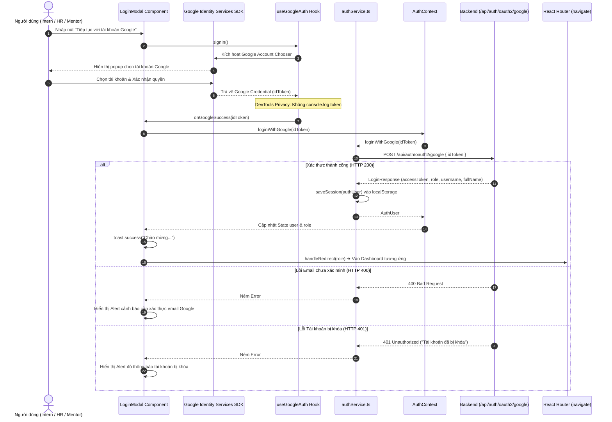

# Kế Hoạch Kỹ Thuật Chi Tiết (Frontend Implementation Plan)
## TM-30: Đăng Nhập Người Dùng Bằng Google OAuth2 (Google Sign-In)

> **Mã Jira Ticket:** [TM-30: Google OAuth2 Login & Account Synchronization](https://robluccibn9935.atlassian.net/browse/TM-30)  
> **Dự án phụ trách:** `InternHub-Frontend`  
> **Tài liệu Backend đối chiếu:**  
> - Đặc tả kỹ thuật: [TM-30-google-oauth2-login-spec.md](file:///d:/codegym_final_project/InternHub/docs/specs/TM-30-google-oauth2-login-spec.md) (v1.3)  
> - Báo cáo hoàn tất Backend: [TM-30-google-oauth2-login-walkthrough.md](file:///d:/codegym_final_project/InternHub/docs/specs/TM-30-google-oauth2-login-walkthrough.md)  
> **Quy chuẩn bắt buộc:**  
> - 34 Nguyên tắc bất biến ([`AGENTS.md`](file:///d:/codegym_final_project/InternHub-Frontend/AGENTS.md))  
> - Quy chuẩn UX/UI ([`08-ui-ux-guidelines.md`](file:///d:/codegym_final_project/InternHub-Frontend/.agents/08-ui-ux-guidelines.md))  
> - Hướng dẫn thiết kế Frontend cao cấp ([`frontend-design/SKILL.md`](file:///d:/codegym_final_project/InternHub-Frontend/.agents/skills/frontend-design/SKILL.md))  
> **Change Level:** **L3** (Tích hợp Google Identity Services SDK, mở rộng Auth Service/Context, Component Google Sign-In Button, nâng cấp LoginModal & RegisterModal)

---

## 1. Tổng Quan Kiến Trúc & Bối Cảnh Tích Hợp (Architectural Context)

### 1.1. Hạ Tầng Backend Đã Sẵn Sàng (API Contract Handshake)
Backend `identity-and-access-service` (Port 8081 qua API Gateway Port 8080) đã hoàn thiện và kiểm thử thành công 100% endpoint công khai:
- **API Endpoint:** `POST /api/auth/oauth2/google` (và alias `/api/employees/auth/oauth2/google`).
- **Request Headers:** `Content-Type: application/json`
- **Request Body JSON:**
  ```json
  {
    "idToken": "eyJhbGciOiJSUzI1NiIsImtpZCI6IjFkMmUzZj...<Google_ID_Token>"
  }
  ```
- **Response Success (HTTP 200 OK):**
  ```json
  {
    "success": true,
    "message": "Đăng nhập bằng tài khoản Google thành công",
    "data": {
      "accessToken": "eyJhbGciOiJIUzI1NiIsInR5cCI6IkpXVCJ9...",
      "tokenType": "Bearer",
      "expiresIn": 86400,
      "username": "cuongle_g128",
      "fullName": "Lê Văn Cường",
      "email": "cuong.le@gmail.com",
      "role": "Intern",
      "userId": 15
    }
  }
  ```
- **Error Responses:**
  - `400 Bad Request`: Email Google chưa được xác minh (`email_verified = false`).
  - `401 Unauthorized`: Token giả mạo/quá hạn hoặc tài khoản bị khóa (`LOCKED`).

### 1.2. Mục Tiêu Kỹ Thuật Phía Frontend
1. **Trải nghiệm đăng nhập 1 chạm (1-Click Frictionless Access):** Ứng viên thực tập sinh và cán bộ doanh nghiệp chỉ cần bấm nút Google để đăng nhập ngay mà không cần nhớ mật khẩu hay chờ đợi OTP email.
2. **Khắc phục đứt gãy luồng đăng ký (Fast-Track Registration):** Tích hợp nút Google Sign-In vào cả `LoginModal` và `RegisterModal`, cho phép ứng viên nộp hồ sơ trực tuyến bỏ qua form đăng ký dài nhiều bước.
3. **Phân quyền tự động theo vai trò (Role-Based Smart Redirect):** Sau khi nhận `LoginResponse`, tự động điều hướng đúng Dashboard theo quyền hạn (`INTERN` ➔ `/intern/dashboard`, `HR` ➔ `/hr/dashboard`, `MENTOR` ➔ `/mentor/dashboard`, `ADMIN` ➔ `/admin/dashboard`).
4. **Bảo mật DevTools & Quyền riêng tư (DevTools Privacy Enforcement):** Tuyệt đối không log token thô ra `console.log`, không truyền token qua URL, đóng gói 100% trong POST JSON body.

---

## 2. Ngôn Ngữ Thiết Kế & Thẩm Mỹ Frontend (Frontend Design System)
*Ứng dụng trực tiếp triết lý thiết kế từ [`frontend-design/SKILL.md`](file:///d:/codegym_final_project/InternHub-Frontend/.agents/skills/frontend-design/SKILL.md)*

### 2.1. Bản Sắc Thị Giác (Subject Matter & Visual Tone)
- **Bối cảnh đối tượng:** Cổng việc làm & Quản trị Thực tập sinh Doanh nghiệp (Enterprise Talent Platform) – Nơi hội tụ các bạn sinh viên Gen-Z năng động và các chuyên gia nhân sự / Mentor doanh nghiệp chuẩn mực.
- **Tôn chỉ thẩm mỹ:** Tinh giản, hiện đại, sắc nét và đáng tin cậy. Tránh hoàn toàn cảm giác "AI Boilerplate" (như viền màu rực rỡ vô cớ, card bo tròn dày cộm, gradient lòe loẹt hoặc các nhãn ALL-CAPS thừa thãi).
- **Tiêu điểm táo bạo (Spend Boldness in One Place):**  
  Tập trung toàn bộ sự trau chuốt vào **"Cụm Đăng Nhập 1-Chạm Chuẩn Doanh Nghiệp (Enterprise Google Sign-In Unit)"**:
  - Nút bấm Google Sign-In được thiết kế tinh tế với chuẩn nhận diện thương hiệu Google (Google Multi-Color 'G' Vector Icon sắc nét 18px).
  - Tỉ lệ tương phản chuẩn mực WCAG AA: Light mode nền sáng thanh lịch viền mảnh `1px solid var(--border-default)`, Dark mode nền tối hòa nhập hoàn hảo vào `var(--bg-card)` với hiệu ứng chuyển màu mềm mại.
  - Phản hồi vi mô (Micro-Interaction): Khi hover, viền nút chuyển sang màu `var(--border-focus)` kèm hiệu ứng nâng nhẹ `transform: translateY(-1px)` và hào quang siêu nhẹ `box-shadow: 0 4px 12px var(--shadow-sm)`.
  - Phân cách ngữ nghĩa (Semantic Visual Divider): Sử dụng đường chỉ kẻ mảnh gradient kết hợp nhãn chữ thường trang nhã: `<span>hoặc tiếp tục với tên đăng nhập</span>`.

### 2.2. Bảng Token Thiết Kế Ngữ Nghĩa (Design Tokens Mapping)
*Tuân thủ Quy tắc: 100% sử dụng CSS Variables từ [`src/index.css`](file:///d:/codegym_final_project/InternHub-Frontend/src/index.css), không hardcode mã Hex trong CSS Modules:*

| Thành Phần Giao Diện | Biến CSS Token | Light Mode | Dark Mode (`[data-theme='dark']`) | Ý Nghĩa Thiết Kế |
| :--- | :--- | :--- | :--- | :--- |
| **Nền Nút Google** | `var(--bg-surface)` | `#ffffff` | `#131d33` | Bề mặt nút bấm sạch sẽ, đồng bộ |
| **Viền Nút Mặc Định** | `var(--border-default)` | `#e2e8f0` | `#26354a` | Đường nét sắc sảo, không viền đậm |
| **Viền Khi Hover/Active**| `var(--border-focus)` | `#818cf8` | `#6366f1` | Báo hiệu trạng thái sẵn sàng tương tác |
| **Màu Chữ Nút** | `var(--text-main)` | `#0f172a` | `#f8fafc` | Chữ tương phản cao, `font-weight: 600` |
| **Đường Kẻ Phân Cách** | `var(--border-subtle)` / gradient | `#f1f5f9` | `#1e293b` | Phân cách nhẹ nhàng, không gây rối mắt |
| **Nhãn Phân Cách** | `var(--text-muted)` | `#94a3b8` | `#64748b` | Văn bản phụ, kích thước nhỏ `0.8125rem` |
| **Trạng Thái Đang Xử Lý**| `var(--primary)` | `#4f46e5` | `#6366f1` | Spinner quay êm ái khi đang xác thực token |

### 2.3. Wireframe Bố Cục `LoginModal` (ASCII Wireframe Layout)

```
┌────────────────────────────────────────────────────────┐
│  [X]                                                   │
│                     (🏢 Icon)                          │
│              Đăng Nhập Cổng Nội Bộ                     │
│    Dành cho cán bộ quản lý, nhân sự, mentor & intern  │
├────────────────────────────────────────────────────────┤
│                                                        │
│  ┌──────────────────────────────────────────────────┐  │
│  │  [ G ]   Tiếp tục với tài khoản Google           │  │  <-- Nút Google Sign-In 1-chạm
│  └──────────────────────────────────────────────────┘  │
│                                                        │
│  ─────── hoặc tiếp tục bằng tên đăng nhập ───────      │  <-- Divider ngữ nghĩa
│                                                        │
│  Tên đăng nhập / Email                                 │
│  ┌──────────────────────────────────────────────────┐  │
│  │ 👤  admin, hr_manager, cuong.le@...              │  │
│  └──────────────────────────────────────────────────┘  │
│                                                        │
│  Mật khẩu                                              │
│  ┌──────────────────────────────────────────────────┐  │
│  │ 🔒  ••••••••                                  👁 │  │
│  └──────────────────────────────────────────────────┘  │
│                                                        │
│  ┌──────────────────────────────────────────────────┐  │
│  │               Đăng Nhập (Nút Chính)              │  │
│  └──────────────────────────────────────────────────┘  │
│                                                        │
│           Chưa có tài khoản?  Đăng ký ngay             │
└────────────────────────────────────────────────────────┘
```

---

## 3. Kiến Trúc Luồng Tương Tác Phía Client (Sequence Flow)



---

## 4. Chi Tiết Các Tệp Mã Nguồn Cần Thay Đổi (File Impact Blueprint)

| Phân Loại | Tệp Tin & Đường Dẫn | Chi Tiết Kỹ Thuật Triển Khai |
| :---: | :--- | :--- |
| **[MODIFY]** | [`src/constants/endpoints/auth.endpoints.ts`](file:///d:/codegym_final_project/InternHub-Frontend/src/constants/endpoints/auth.endpoints.ts) | Khai báo hằng số API mới: `GOOGLE_LOGIN: '/api/auth/oauth2/google'`. |
| **[MODIFY]** | [`src/types/auth.types.ts`](file:///d:/codegym_final_project/InternHub-Frontend/src/types/auth.types.ts) | Bổ sung interface `GoogleLoginRequest { idToken: string }`. |
| **[MODIFY]** | [`src/services/authService.ts`](file:///d:/codegym_final_project/InternHub-Frontend/src/services/authService.ts) | Bổ sung method `loginWithGoogle(idToken: string): Promise<AuthUser>`, chuẩn hóa dữ liệu trả về và lưu phiên. |
| **[MODIFY]** | [`src/contexts/AuthContext.tsx`](file:///d:/codegym_final_project/InternHub-Frontend/src/contexts/AuthContext.tsx) | Mở rộng `AuthContextType` với `loginWithGoogle: (idToken: string) => Promise<AuthUser>`. |
| **[NEW]** | [`src/hooks/useGoogleAuth.ts`](file:///d:/codegym_final_project/InternHub-Frontend/src/hooks/useGoogleAuth.ts) | Custom Hook tải script GIS bất đồng bộ, khởi tạo client Google ID an toàn và xử lý callback. |
| **[MODIFY]** | [`src/hooks/index.ts`](file:///d:/codegym_final_project/InternHub-Frontend/src/hooks/index.ts) | Barrel export cho `useGoogleAuth`. |
| **[NEW]** | [`src/components/auth/GoogleSignInButton.tsx`](file:///d:/codegym_final_project/InternHub-Frontend/src/components/auth/GoogleSignInButton.tsx) | Component nút đăng nhập Google tuân thủ Google Brand Guidelines & InternHub Design Tokens. |
| **[NEW]** | [`src/components/auth/GoogleSignInButton.module.css`](file:///d:/codegym_final_project/InternHub-Frontend/src/components/auth/GoogleSignInButton.module.css) | Định kiểu CSS Module cô lập, responsive và 100% sử dụng biến token từ `index.css`. |
| **[MODIFY]** | [`src/components/auth/index.ts`](file:///d:/codegym_final_project/InternHub-Frontend/src/components/auth/index.ts) | Barrel export cho `GoogleSignInButton`. |
| **[MODIFY]** | [`src/components/auth/LoginModal.tsx`](file:///d:/codegym_final_project/InternHub-Frontend/src/components/auth/LoginModal.tsx) | Tích hợp `GoogleSignInButton` + Divider ngữ nghĩa + Luồng xử lý điều hướng theo role. |
| **[MODIFY]** | [`src/components/auth/LoginModal.module.css`](file:///d:/codegym_final_project/InternHub-Frontend/src/components/auth/LoginModal.module.css) | Bổ sung styles cho khu vực Google Button và Divider ngữ nghĩa. |
| **[MODIFY]** | [`src/components/auth/RegisterModal.tsx`](file:///d:/codegym_final_project/InternHub-Frontend/src/components/auth/RegisterModal.tsx) | Thêm tùy chọn đăng ký nhanh 1-chạm bằng Google tại đầu Bước 1 của Modal đăng ký. |

---

## 5. Thiết Kế Chi Tiết Từng Thành Phần (Component Blueprint)

### 5.1. Cập Nhật Endpoints & Types
- **`src/constants/endpoints/auth.endpoints.ts`**:
  ```typescript
  export const AUTH_ENDPOINTS = {
    LOGIN: '/api/auth/login',
    REGISTER: '/api/auth/register',
    GOOGLE_LOGIN: '/api/auth/oauth2/google',
    ACTIVATE: '/api/auth/activate',
    RESEND_ACTIVATION: '/api/auth/resend-activation',
    ME: '/api/auth/me',
    REFRESH: '/api/auth/refresh',
    LOGOUT: '/api/auth/logout',
  } as const;
  ```
- **`src/types/auth.types.ts`**:
  ```typescript
  export interface GoogleLoginRequest {
    idToken: string;
  }
  ```

### 5.2. Mở Rộng `authService.ts`
Thêm hàm `loginWithGoogle(idToken: string)` đồng bộ lưu trữ phiên tương tự hàm `login()` truyền thống:
```typescript
async loginWithGoogle(idToken: string): Promise<AuthUser> {
  try {
    const response = await apiClient.post(API_ENDPOINTS.AUTH.GOOGLE_LOGIN, { idToken });
    const data = response.data.data;
    const roleRaw = data.role ? data.role.toUpperCase().replace('ROLE_', '') : 'INTERN';
    const authUser: AuthUser = {
      userId: data.userId,
      username: data.username,
      fullName: data.fullName,
      email: data.email,
      role: (roleRaw === 'USER' || roleRaw === 'INTERN') ? 'INTERN' : ((roleRaw as RoleType) || 'INTERN'),
      accessToken: data.accessToken,
      tokenType: data.tokenType || 'Bearer',
      expiresIn: data.expiresIn,
    };
    this.saveSession(authUser);
    return authUser;
  } catch (error: any) {
    if (error?.response?.data?.message) {
      throw new Error(error.response.data.message);
    }
    if (error instanceof Error) {
      throw error;
    }
    throw new Error('Đăng nhập bằng tài khoản Google không thành công. Vui lòng thử lại.');
  }
}
```

### 5.3. Mở Rộng `AuthContext.tsx`
Cung cấp phương thức `loginWithGoogle` để bất kỳ component nào trong cây ứng dụng đều có thể kích hoạt đăng nhập và tự động cập nhật State:
```typescript
const loginWithGoogle = async (idToken: string): Promise<AuthUser> => {
  const authUser = await authService.loginWithGoogle(idToken);
  setUser(authUser);
  return authUser;
};
```

### 5.4. Xây Dựng Hook `useGoogleAuth.ts`
Hook thông minh quản lý vòng đời của Google Identity Services:
- Nạp động script `https://accounts.google.com/gsi/client` một lần duy nhất.
- Nạp Google Client ID từ `import.meta.env.VITE_GOOGLE_CLIENT_ID || 'mock-google-client-id'` (Tuân thủ Rule #12: Không đọc trực tiếp file `.env`).
- Quản lý các trạng thái: `isScriptLoaded`, `isAuthenticating`, `authError`.
- Hàm kích hoạt xác thực và tiếp nhận credential callback.

### 5.5. Xây Dựng Component `GoogleSignInButton.tsx` & `GoogleSignInButton.module.css`
- **Branding Google chính hãng:** Icon SVG 4 màu đỏ, vàng, lục, lam chuẩn xác của Google.
- **Tiêu chuẩn tương phản:** Đạt WCAG AA trên cả 2 giao diện sáng/tối.
- **Hỗ trợ trạng thái Loading:** Khi bấm nút, hiển thị spinner êm ái kèm text *"Đang kết nối Google..."*, khóa nút chống bấm đúp (Double-Click Prevention).
- **Phím điều hướng (Accessibility):** Có `tabIndex={0}`, hỗ trợ phím `Enter` / `Space`, có `aria-label="Đăng nhập bằng tài khoản Google"`.

### 5.6. Tích Hợp Vào `LoginModal.tsx` & `LoginModal.module.css`
- Bổ sung `GoogleSignInButton` ở vị trí hàng đầu (phía trên form username/password).
- Bổ sung Divider ngữ nghĩa:
  ```tsx
  <div className={styles.divider}>
    <span className={styles.dividerLine} />
    <span className={styles.dividerText}>hoặc tiếp tục với mật khẩu</span>
    <span className={styles.dividerLine} />
  </div>
  ```
- Kết nối sự kiện đăng nhập thành công với `handleRedirect(authUser.role)`:
  - `INTERN` ➔ Chuyển hướng tới `/intern/dashboard`.
  - `HR` ➔ Chuyển hướng tới `/hr/dashboard`.
  - `MENTOR` ➔ Chuyển hướng tới `/mentor/dashboard`.
  - `ADMIN` ➔ Chuyển hướng tới `/admin/dashboard`.
- Hiển thị Alert lỗi tương ứng nếu Backend từ chối (400 hoặc 401).

---

## 6. Tuân Thủ Nghiêm Ngặt Các Quy Tắc Dự Án (Rule Compliance Matrix)

| Quy Chuẩn | Yêu Cầu Cốt Lõi | Giải Pháp Thực Thi Trong Kế Hoạch |
| :--- | :--- | :--- |
| **Rule #7 (Boundary Isolation)** | Không sửa file Backend khi đang làm Frontend | 100% phạm vi tác động nằm trong `InternHub-Frontend/`. |
| **Rule #12 (Strict Zero-Access `.env`)** | Cấm AI đọc, sửa, phân tích file `.env` | Nạp biến qua `import.meta.env.VITE_GOOGLE_CLIENT_ID` kèm fallback an toàn `'mock-google-client-id'`. |
| **Rule #13 (Domain-Driven Modular)** | Cấm tạo God Files, duy trì barrel export | Tách riêng Hook `useGoogleAuth`, Component `GoogleSignInButton` và export qua `index.ts`. |
| **Rule #18 & 08-UI-UX Guidelines** | Modal-First, không hardcode mã Hex | Giữ nguyên trải nghiệm trên `LoginModal`, dùng 100% CSS Variables từ `src/index.css`. |
| **# Frontend Design Skill** | Tránh AI boilerplate, tập trung điểm nhấn táo bạo | Nút bấm Google Sign-In được thiết kế tinh tế với phản hồi vi mô, đường kẻ divider mềm mại. |
| **DevTools Privacy (Rule #6)** | Chống lộ lọt Token trên DevTools & Console | Không có lệnh `console.log(credential)` hoặc `console.log(idToken)`; gửi token qua POST body JSON. |

---

## 7. Trình Tự Thực Thi Từng Bước (Implementation Roadmap)

```
[Giai đoạn 1: Chuẩn Bị Tầng Dữ Liệu & Service]
  ├── 1.1. Cập nhật auth.endpoints.ts (thêm GOOGLE_LOGIN)
  ├── 1.2. Mở rộng auth.types.ts (thêm GoogleLoginRequest)
  ├── 1.3. Cập nhật authService.ts (viết hàm loginWithGoogle)
  └── 1.4. Mở rộng AuthContext.tsx (expose loginWithGoogle)
          ↓
[Giai đoạn 2: Xây Dựng Hook & Component Google Sign-In]
  ├── 2.1. Viết hook useGoogleAuth.ts & export tại hooks/index.ts
  ├── 2.2. Xây dựng GoogleSignInButton.tsx & GoogleSignInButton.module.css
  └── 2.3. Export GoogleSignInButton tại components/auth/index.ts
          ↓
[Giai đoạn 3: Tích Hợp Vào LoginModal & RegisterModal]
  ├── 3.1. Cập nhật LoginModal.tsx (gắn GoogleSignInButton, Divider, role redirect)
  ├── 3.2. Cập nhật LoginModal.module.css (styles divider, google button wrapper)
  └── 3.3. Tích hợp tùy chọn 1-chạm tại Bước 1 của RegisterModal.tsx
          ↓
[Giai đoạn 4: Kiểm Tra Chất Lượng & Xác Minh]
  ├── 4.1. Chạy npm run lint (oxlint) kiểm tra lỗi cú pháp & code style
  ├── 4.2. Chạy npm run build (tsc -b && vite build) kiểm tra TypeScript type check
  └── 4.3. Báo cáo Walkthrough hoàn thành
```

---

## 8. Tiêu Chí Nghiệm Thu (Acceptance Criteria Checklist)

- [ ] **AC-FE-1:** `LoginModal` hiển thị nút Google Sign-In rõ nét, đẹp mắt, có icon Google vector chính thức và divider phân cách trang nhã.
- [ ] **AC-FE-2:** Nhấp vào nút Google kích hoạt thành công Google Identity Services popup/prompt.
- [ ] **AC-FE-3:** Tiếp nhận `idToken` từ Google và gọi chính xác API `POST /api/auth/oauth2/google` (qua proxy Vite `http://localhost:8080`).
- [ ] **AC-FE-4:** Sau khi nhận `LoginResponse` thành công, lưu token vào `localStorage`, hiển thị toast chào mừng và chuyển hướng chính xác tới Dashboard theo role (`Intern`, `HR`, `Mentor`, `Admin`).
- [ ] **AC-FE-5:** Hiển thị thông báo Alert lỗi thân thiện nếu Google ID Token không hợp lệ hoặc email chưa được kích hoạt.
- [ ] **AC-FE-6:** Trạng thái Loading spinner mượt mà và nút bị vô hiệu hóa khi đang trong tiến trình xác thực token.
- [ ] **AC-FE-7:** Giao diện hoàn toàn tương thích và hiển thị sắc nét trên cả Light Mode và Dark Mode.
- [ ] **AC-FE-8 (DevTools Privacy):** Không có bất kỳ dòng log nào in chuỗi `credential` hoặc `idToken` ra Console.
- [ ] **AC-FE-9 (Rule #12):** Không truy cập file `.env`; biến môi trường client có giá trị fallback an toàn.
- [ ] **AC-FE-10 (Build & Lint):** Lệnh `npm run lint` và `npm run build` chạy thành công không có lỗi type hay syntax.
