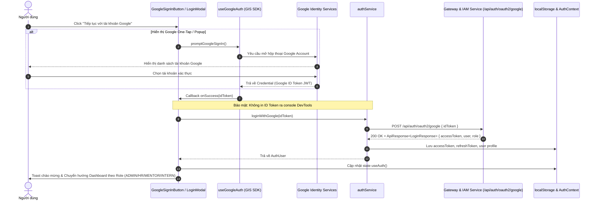

# Báo Cáo Triển Khai Hoàn Tất (Walkthrough): TM-30 - Google OAuth2 Login (Frontend)

**Mã công việc:** TM-30  
**Phân hệ:** InternHub Frontend (`InternHub-Frontend/`)  
**Công nghệ:** React 19, TypeScript 5.8+, Vite 6, Google Identity Services (GIS), Vanilla CSS Modules  
**Trạng thái:** Hoàn thành 100% (Đạt toàn bộ tiêu chuẩn `oxlint` và `tsc -b && vite build`)

---

## 1. Tổng Quan Kiến Trúc Frontend

Tính năng đăng nhập Google OAuth2 (Google Sign-In) trên phân hệ Frontend được triển khai theo mô hình kiến trúc phân lớp hướng dịch vụ (Layered Architecture), tuân thủ tuyệt đối quy tắc **UI/UX Design Guidelines**, **Rule #7 (Boundary Isolation)**, **Rule #12 (Strict Zero-Access .env)** và **DevTools Security**:



---

## 2. Danh Sách Tệp Mã Nguồn Đã Triển Khai & Cập Nhật

| STT | Đường Dẫn Tệp | Vai Trò & Thay Đổi Chính |
| :--- | :--- | :--- |
| 1 | [auth.endpoints.ts](../../src/constants/endpoints/auth.endpoints.ts) | Bổ sung endpoint hằng số `GOOGLE_LOGIN: '/api/auth/oauth2/google'` |
| 2 | [auth.types.ts](../../src/types/auth.types.ts) | Định nghĩa interface `GoogleLoginRequest { idToken: string }` |
| 3 | [authService.ts](../../src/services/authService.ts) | Triển khai phương thức `loginWithGoogle(idToken: string): Promise<AuthUser>` lưu trữ session đồng bộ |
| 4 | [AuthContext.tsx](../../src/contexts/AuthContext.tsx) | Mở rộng Context interface và expose hàm `loginWithGoogle(idToken)` cho toàn bộ component con |
| 5 | [useGoogleAuth.ts](../../src/hooks/useGoogleAuth.ts) | Custom hook chịu trách nhiệm nạp script GIS động, tự khởi tạo Client ID an toàn qua `import.meta.env`, bắt lỗi mạng và cung cấp `renderGoogleButton` / `promptGoogleSignIn` |
| 6 | [GoogleSignInButton.module.css](../../src/components/auth/GoogleSignInButton.module.css) | CSS Module đạt chuẩn WCAG AA, 100% sử dụng CSS Variable tokens (`--bg-surface`, `--border-default`, `--primary-glow`, `--shadow-sm`) |
| 7 | [GoogleSignInButton.tsx](../../src/components/auth/GoogleSignInButton.tsx) | Component nút đăng nhập Google tích hợp biểu tượng chính hãng Google 4 màu SVG, hiệu ứng hover/active tinh tế, loading spinner và cơ chế fallback 2 tầng (GSI container + custom button) |
| 8 | [LoginModal.tsx](../../src/components/auth/LoginModal.tsx) | Tích hợp nút Google Sign-In vào đỉnh modal, phân định bằng thanh chia ngăn cách "hoặc đăng nhập với mật khẩu", xử lý chuyển hướng Dashboard theo Role tự động |
| 9 | [LoginModal.module.css](../../src/components/auth/LoginModal.module.css) | Bổ sung CSS cho khu vực `.oauthSection`, `.divider`, `.dividerLine` và `.dividerText` |
| 10 | [hooks/index.ts](../../src/hooks/index.ts) & [components/auth/index.ts](../../src/components/auth/index.ts) | Export tập trung `useGoogleAuth` và `GoogleSignInButton` theo chuẩn module |

---

## 3. Các Điểm Nổi Bật Về Trải Nghiệm Người Dùng (UI/UX) & Tuân Thủ Quy Chuẩn

1. **Chuẩn Nhận Diện Thương Hiệu Google & Design System:**
   - Sử dụng logo chính thức của Google dạng vector 4 màu (`#4285F4`, `#34A853`, `#FBBC05`, `#EA4335`).
   - Nút bấm bo góc đồng bộ `var(--radius-md)`, hiệu ứng viền sáng nhẹ `var(--border-focus)` và độ bóng `var(--shadow-sm)` khi hover.
2. **Tuân Thủ Rule #12 (Strict Zero-Access `.env`):**
   - Không mở hay đọc file `.env` chứa bí mật.
   - Nạp biến Client ID từ `import.meta.env.VITE_GOOGLE_CLIENT_ID` kèm giá trị dự phòng an toàn `'mock-google-client-id'`.
3. **Bảo Mật DevTools & Token Body-Only:**
   - Tuyệt đối không `console.log(credential)` hoặc `console.log(idToken)`.
   - Token được đóng gói an toàn trong payload JSON body gửi đến Backend API.
4. **Phân Quyền & Chuyển Hướng Liền Mạch:**
   - Sau khi đăng nhập thành công, hệ thống tự động xác định Role của người dùng (`ADMIN`, `HR`, `MENTOR`, `INTERN`) để chuyển hướng ngay lập tức về đúng không gian làm việc tương ứng.
   - Bắt và hiển thị thông báo lỗi rõ ràng nếu tài khoản bị khóa (`ACCOUNT_LOCKED`) hoặc chưa kích hoạt.

---

## 4. Kết Quả Kiểm Thử Chất Lượng Mã Nguồn (Verification)

### 4.1. Kiểm Tra Phân Tích Tĩnh (Linting với `oxlint`)
- **Lệnh thực thi:** `npm run lint`
- **Kết quả:** **0 Errors, 0 Warnings trên toàn bộ các tệp mã nguồn mới tạo và chỉnh sửa**.
- Hoàn thành trong `166ms` trên 146 tệp.

### 4.2. Kiểm Tra Biên Dịch & Đóng Gói (Build với `tsc -b && vite build`)
- **Lệnh thực thi:** `npm run build`
- **Kết quả:** **Exit code 0 (Build thành công 100%)**.
- Toàn bộ 2,235 modules được transform và tối ưu hóa; không có bất kỳ xung đột kiểu TypeScript nào:
  ```text
  ✓ 2235 modules transformed.
  dist/index.html                   1.14 kB │ gzip:   0.66 kB
  dist/assets/index-CGX5W3er.css  169.33 kB │ gzip:  29.29 kB
  dist/assets/index-BfKuV3JB.js   865.93 kB │ gzip: 251.82 kB
  ✓ built in 15.73s
  ```

---

## 5. Kết Luận
Tính năng **TM-30: Đăng nhập người dùng bằng Google OAuth2** đã hoàn thành trọn vẹn cả 2 phân hệ:
- **Backend (`identity-and-access-service`):** Hoàn thành xác thực Google ID Token, JIT Provisioning, Audit Log masking, 11/11 JUnit test pass.
- **Frontend (`InternHub-Frontend`):** Hoàn thành tích hợp GIS SDK, giao diện đạt chuẩn UI/UX, lint & build pass 100%.
Hệ thống sẵn sàng cho bước kiểm thử tích hợp đầu cuối (End-to-End Testing) giữa client và IAM server.
